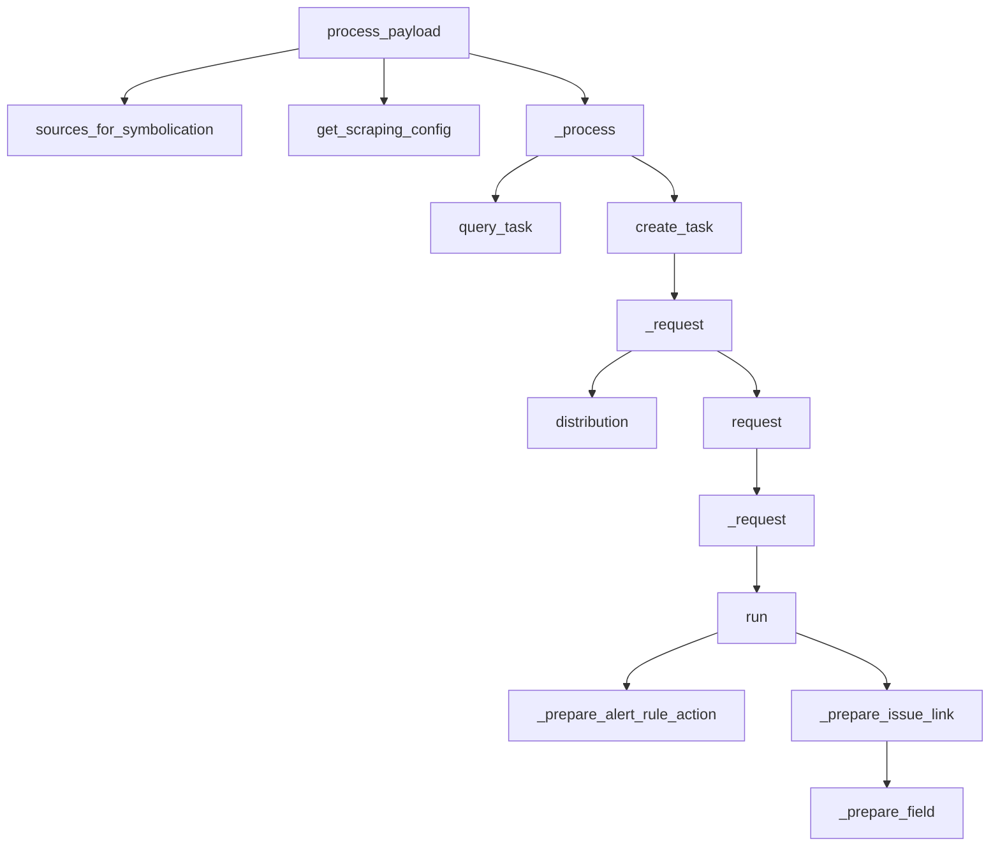

This document will cover the process of error tracking and performance monitoring in the Sentry application. We'll cover:

1. The entry point for processing the payload
2. Gathering necessary data for processing
3. Submitting a symbolication task to a Symbolicator
4. Handling polling and errors
5. Preparing components based on their type

Technical document: <SwmLink doc-title="Understanding the process_payload Function">[Understanding the process_payload Function](/.swm/understanding-the-process_payload-function.anqlc41d.sw.md)</SwmLink>

# The Entry Point for Processing the Payload

The process begins with the `process_payload` function. This function is responsible for accepting stacktraces, modules, and optional signal and apply_source_context parameters. It then calls the `sources_for_symbolication` and `get_scraping_config` functions to gather the necessary data for processing.

# Gathering Necessary Data for Processing

The `sources_for_symbolication` function is invoked within `process_payload`. It returns a list of symbol sources to attach to a native symbolication request, as well as a closure to post-process the resulting JSON response. It also constructs maps for use in `_process_response()`. The `get_sources_for_project` function is called within `sources_for_symbolication`. It returns a list of symbol sources for the project. It checks the organization's access to symbol sources and adds builtin sources last to ensure that custom sources have precedence over defaults. The `get_scraping_config` function is called within `process_payload`. It returns the scraping configuration for the project. It checks the organization and project level scraping permissions and returns the scraping configuration.

# Submitting a Symbolication Task to a Symbolicator

The `_process` function is the starting point of the flow. It submits a symbolication task to a Symbolicator and handles polling it using the `SymbolicatorSession`. It also handles `TaskIdNotFound` and `ServiceUnavailable` errors. If the task is not found, it resubmits the task. If the service is unavailable, it resets the worker id and resubmits the task.

# Handling Polling and Errors

The `query_task` function is called within the `_process` function. It is used to query the status of a task from the Symbolicator. It does this by making a GET request to the Symbolicator with the task id. The `create_task` function is also called within the `_process` function. It is used to submit a new task to the Symbolicator. If the task is still pending after one timeout period, the task id is stored and the task is polled again.

# Preparing Components Based on Their Type

The `run` function checks the type of the component and calls the appropriate function to prepare the component. For example, if the component type is 'issue-link', it calls the `_prepare_issue_link` function. The `_prepare_issue_link` function prepares the issue link by getting the required and optional fields from the schema and calling the `_prepare_field` function for each field. Similarly, the `_prepare_alert_rule_action` function prepares the alert rule action by getting the required and optional fields from the settings of the schema and calling the `_prepare_field` function for each field. The `_prepare_field` function prepares a field by checking if it depends on other fields. If it does, it gets the dependent data and updates the choices of the field. If not, it simply gets the select choices for the field.

&nbsp;

*This is an auto-generated document by Swimm AI 🌊 and has not yet been verified by a human*

<SwmMeta version="3.0.0" repo-id="Z2l0aHViJTNBJTNBc2VudHJ5LWRlbW8lM0ElM0FTd2ltbS1EZW1v" repo-name="sentry-demo" doc-type="product-flows">Powered by [Swimm](/)</SwmMeta>
