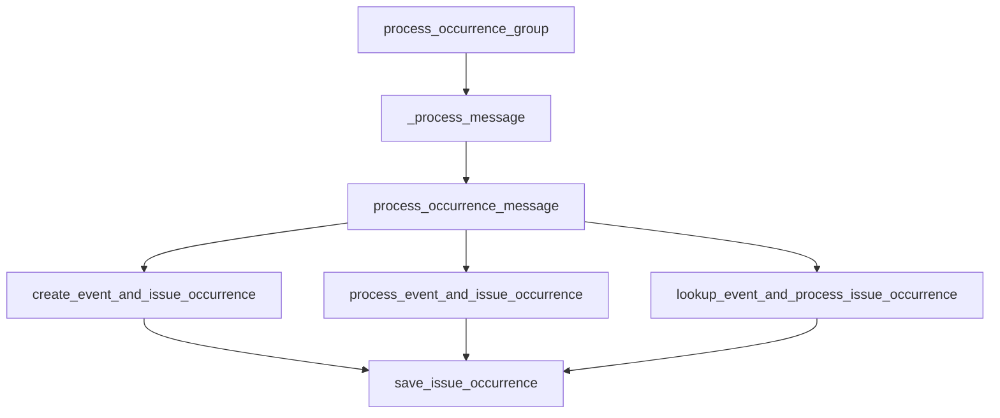

This document will cover the process of error tracking and performance monitoring in Sentry, focusing on the 'process_occurrence_group' function. We'll cover:

1. The purpose of the 'process_occurrence_group' function
2. How the function processes a group of related occurrences
3. The role of the '\_process_message' function
4. The creation and processing of event and issue occurrences
5. The saving of issue occurrences.

Technical document: <SwmLink doc-title="Understanding process_occurrence_group">[Understanding process_occurrence_group](/.swm/understanding-process_occurrence_group.879aluld.sw.md)</SwmLink>

# Purpose of the 'process_occurrence_group' function

The 'process_occurrence_group' function is a key part of the Sentry error tracking and performance monitoring platform. It is responsible for processing a group of related occurrences in a serial manner. This means that it takes a list of related occurrences and processes each one individually, in the order they appear in the list.

# Processing a group of related occurrences

The function fetches the project and organization from the cache using the project_id from the first item in the list. If the organization has the feature 'occurence-consumer-prune-status-changes', it prunes the status changes from the items. This means that it removes any status changes from the list of items to be processed. It then processes each item in the list using the '\_process_message' function.

# Role of the '\_process_message' function

The '\_process_message' function is called by 'process_occurrence_group' to process a single message. It checks the payload type of the message and based on that, it either processes a status change message or an occurrence message. This means that it determines what type of message it is dealing with and processes it accordingly.

# Creation and processing of event and issue occurrences

The 'process_occurrence_message' function processes an occurrence message. It fetches the project and organization from the cache using the project_id from the occurrence data. It then checks if the group type allows ingestion. If it does, it checks if the event data is present in the kwargs. If it is, it either creates an event and issue occurrence or processes an event and issue occurrence. If the event data is not present, it looks up the event and processes the issue occurrence.

# Saving of issue occurrences

The 'save_issue_occurrence' function saves an issue occurrence. It converts the occurrence data to an 'IssueOccurrence' object and saves it. This means that it takes the data from the occurrence, transforms it into a format that can be saved, and then saves it.

&nbsp;

*This is an auto-generated document by Swimm AI 🌊 and has not yet been verified by a human*

<SwmMeta version="3.0.0" repo-id="Z2l0aHViJTNBJTNBc2VudHJ5LWRlbW8lM0ElM0FTd2ltbS1EZW1v" repo-name="sentry-demo" doc-type="product-flows">Powered by [Swimm](/)</SwmMeta>
