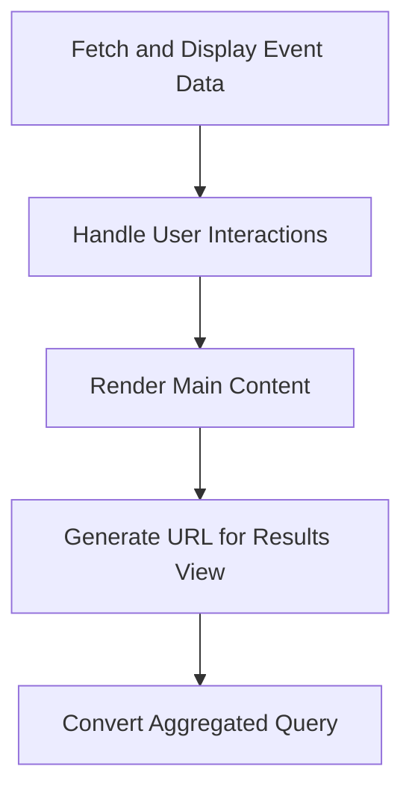

This document will cover the Event Details Content feature in Sentry, which includes:

1. Fetching and displaying event data
2. Handling user interactions
3. Rendering the main content of the event details page
4. Generating the URL for the results view
5. Converting an aggregated query into one that does not have aggregates.

Technical document: <SwmLink doc-title="Understanding EventDetailsContent">[Understanding EventDetailsContent](/.swm/understanding-eventdetailscontent.173lythi.sw.md)</SwmLink>

# Fetching and Displaying Event Data

The Event Details Content feature fetches and displays detailed information about specific events based on provided properties, such as the event slug. This allows users to view comprehensive data about each event, aiding in debugging and issue resolution.

# Handling User Interactions

User interactions, such as toggling the visibility of the sidebar, are handled within this feature. This provides a dynamic and interactive user experience, allowing users to customize their view of the event details.

# Rendering the Main Content

The main content of the event details page is rendered by this feature. It checks if the event data is available, and if not, it displays a 'Not Found' component. If the event data is available, it renders the event details, including the event metadata, event entries, and other related information. This ensures that users are presented with a comprehensive and informative view of the event details.

# Generating the URL for the Results View

This feature generates the URL for the results view. It takes in a slug and a boolean indicating whether the current page is the homepage. It returns an object containing the pathname and query string for the results view URL. This allows users to easily navigate to the results view from the event details page.

# Converting an Aggregated Query

The feature converts an aggregated query into one that does not have aggregates. It also applies additional conditions defined in 'additionalConditions' and generates conditions based on the 'dataRow' parameter and the current fields in the 'eventView'. This ensures that the query results are accurate and relevant to the event details being viewed.

&nbsp;

*This is an auto-generated document by Swimm AI 🌊 and has not yet been verified by a human*

<SwmMeta version="3.0.0" repo-id="Z2l0aHViJTNBJTNBc2VudHJ5LWRlbW8lM0ElM0FTd2ltbS1EZW1v" repo-name="sentry-demo" doc-type="product-flows">Powered by [Swimm](/)</SwmMeta>
