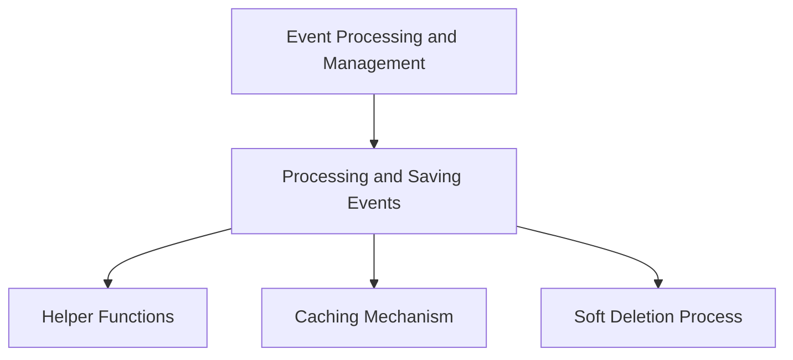

This document will provide a detailed understanding of the 'Event Processing and Management' feature in the Sentry application. We'll cover:

1. The purpose and functionality of the 'Event Processing and Management' feature.
2. The steps involved in processing and saving events.
3. The role of helper functions in processing jobs.
4. The caching mechanism and its impact on performance.
5. The soft deletion process and its implications.

Technical document: <SwmLink doc-title="Understanding save_generic_events Function">[Understanding save_generic_events Function](/.swm/understanding-save_generic_events-function.lmozq59z.sw.md)</SwmLink>

# Event Processing and Management

The 'Event Processing and Management' feature is a crucial part of the Sentry application. It is responsible for handling, processing, and saving events. This feature ensures that all events are correctly processed and stored, enabling users to track and monitor errors and performance issues effectively.

# Processing and Saving Events

The process of saving events involves several steps. Initially, the system fetches the organizations associated with the projects. Then, it sets a cached field value for each project's organization. Following this, the system calls several helper functions to process the jobs. Each job represents a task that needs to be executed.

# Helper Functions

Several helper functions assist in processing the jobs. These functions each perform a specific task in the processing of the jobs, ensuring that each job is correctly processed and handled. The functions include tasks such as creating releases, deriving tags, materializing event metrics, and more.

# Caching Mechanism

The caching mechanism is used to fetch data from the cache. If the required data is not in the cache, it fetches them from the database and stores them in the cache. This mechanism improves the performance of the system by reducing the need for database queries. After saving an instance, the system pushes changes to the instance into the cache and removes invalid (changed) lookup values.

# Soft Deletion Process

The soft deletion process is used to delete an instance by updating the 'date_deleted' field to the current time. This process ensures that the data is not permanently deleted from the system, allowing for potential recovery if necessary. This process is part of the 'paranoia' module in Sentry, which provides utilities for soft deletion.

&nbsp;

*This is an auto-generated document by Swimm AI 🌊 and has not yet been verified by a human*

<SwmMeta version="3.0.0" repo-id="Z2l0aHViJTNBJTNBc2VudHJ5LWRlbW8lM0ElM0FTd2ltbS1EZW1v" repo-name="sentry-demo" doc-type="product-flows">Powered by [Swimm](/)</SwmMeta>
