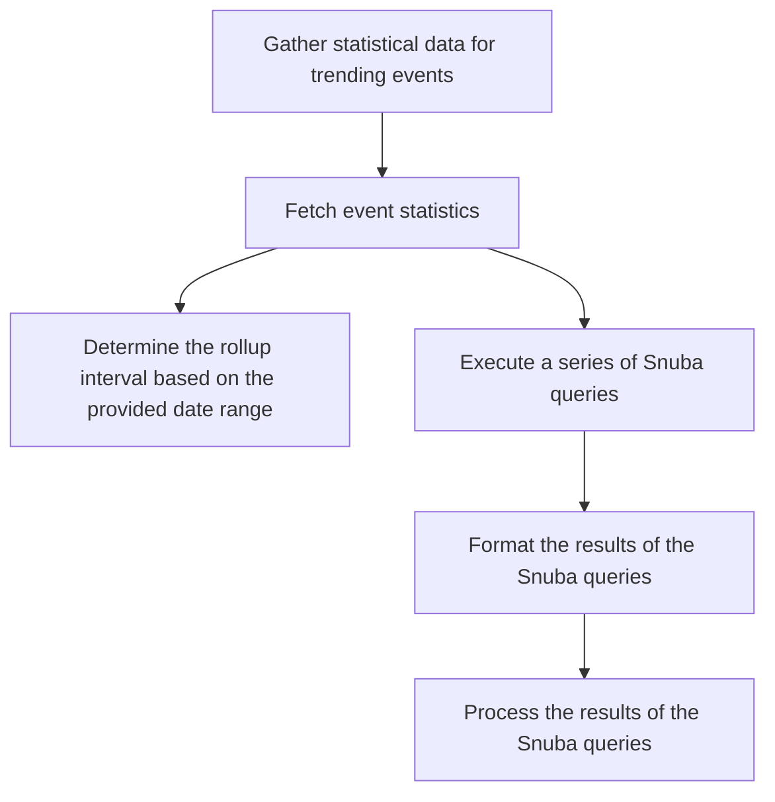

This document will cover the process of gathering and processing event statistics in the Sentry application. The main steps include:

1. Gathering statistical data for trending events
2. Fetching event statistics
3. Determining the rollup interval based on the provided date range
4. Executing a series of Snuba queries
5. Formatting the results of the Snuba queries
6. Processing the results of the Snuba queries.

Technical document: <SwmLink doc-title="Understanding get_stats_data_for_trending_events Function">[Understanding get_stats_data_for_trending_events Function](/.swm/understanding-get_stats_data_for_trending_events-function.obnyw3i1.sw.md)</SwmLink>

# Gathering statistical data for trending events

The first step in the process is to gather statistical data for trending events. This is done by checking if the 'withTimeseries' parameter is set in the request. If it is, the `stats_data` is assigned to `trending_transaction_names_stats`. If it's not, the function iterates over the results data, and for each transaction, it checks if the transaction is present in the `stats_data`. If it is, it selects the stats data for that transaction and updates the `trending_transaction_names_stats` with the selected stats data.

# Fetching event statistics

The next step is to fetch the event statistics. This is done by setting up the query parameters and columns, and then calling the `get_event_stats` function to fetch the event statistics. The results are then serialized and returned.

# Determining the rollup interval

The rollup interval is determined based on the provided date range. The date range is parsed into an interval and validated before returning the total seconds of the interval.

# Executing Snuba queries

A series of Snuba queries are executed to fetch the event statistics. This is done by incrementing a metrics counter and then delegating to the `bulk_snuba_queries_with_referrers` function to perform the actual queries.

# Formatting the results

The results of the Snuba queries are then formatted. This is done by checking if there are any results and if not, a zero-filled series is returned. The results are then processed and formatted into a dictionary of `SnubaTSResult` objects.

# Processing the results

The final step is to process the results of the Snuba queries. This is done by setting up a map of translated columns, then processing the field meta and results. The processed results are then returned.

&nbsp;

*This is an auto-generated document by Swimm AI 🌊 and has not yet been verified by a human*

<SwmMeta version="3.0.0" repo-id="Z2l0aHViJTNBJTNBc2VudHJ5LWRlbW8lM0ElM0FTd2ltbS1EZW1v" repo-name="sentry-demo" doc-type="product-flows">Powered by [Swimm](/)</SwmMeta>
