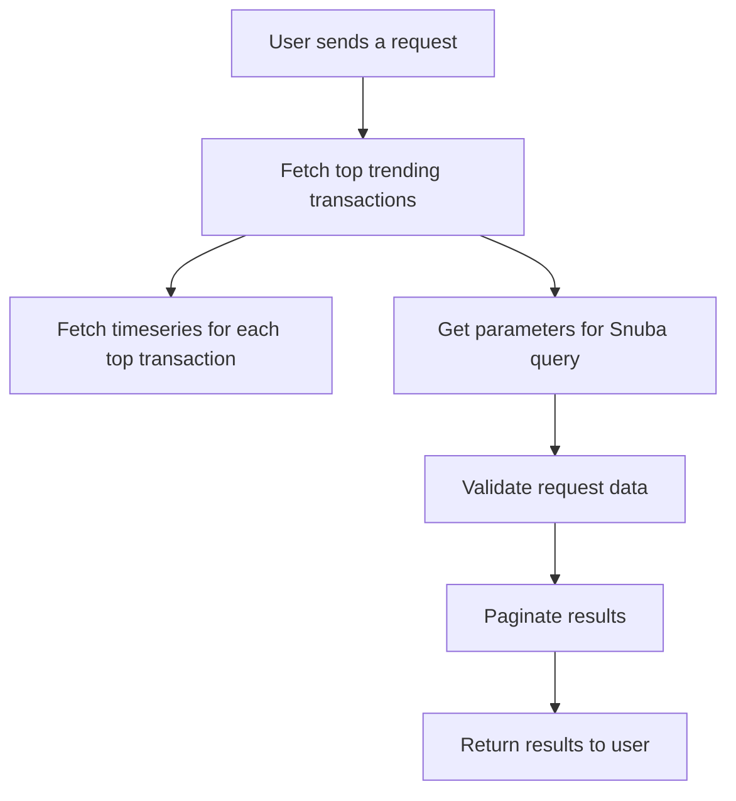

This document will cover the 'Event Statistics Metrics' feature of the Sentry application. We'll cover:

1. How the application fetches top trending transactions based on user queries and parameters.
2. How it fetches the timeseries for each top transaction.
3. How it gets the parameters for the Snuba query.
4. How it validates the request data and paginates the results before returning them.

Technical document: <SwmLink doc-title="Understanding get_event_stats_metrics">[Understanding get_event_stats_metrics](/.swm/understanding-get_event_stats_metrics.7npf7341.sw.md)</SwmLink>

# Fetching Top Trending Transactions

When a user sends a request, the application first determines the limit for the top events, then fetches the top trending transactions. If no top trending transactions are found, it returns an empty dictionary. Otherwise, it fetches the timeseries for each top transaction name.

# Fetching Timeseries for Each Top Transaction

The application splits the top events into multiple queries for a bulk timeseries query. It then prunes the projects to reduce query cardinality and performs a bulk timeseries query. The results are then parsed and formatted before being returned.

# Getting Parameters for Snuba Query

The application retrieves the parameters for the Snuba query. It checks if exactly one project is specified in the parameters, otherwise, it raises an error.

# Validating Request Data and Paginating Results

The application gets the Snuba parameters and validates the request data. It then performs a query to get the suspect span groups and paginates the results before returning them.

&nbsp;

*This is an auto-generated document by Swimm AI 🌊 and has not yet been verified by a human*

<SwmMeta version="3.0.0" repo-id="Z2l0aHViJTNBJTNBc2VudHJ5LWRlbW8lM0ElM0FTd2ltbS1EZW1v" repo-name="sentry-demo" doc-type="product-flows">Powered by [Swimm](/)</SwmMeta>
