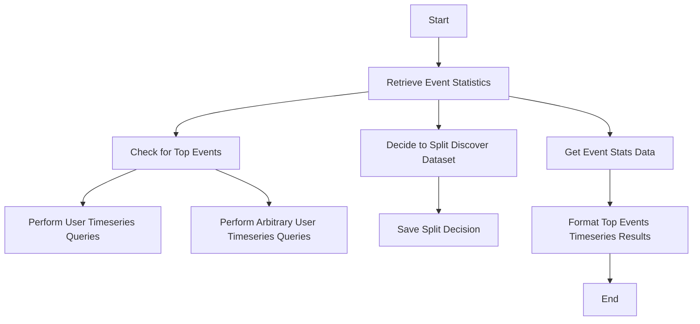

This document will cover the Event Statistics Retrieval feature of the Sentry application. We'll cover:

1. The purpose of the Event Statistics Retrieval feature
2. The process of retrieving event statistics
3. The decision-making process for splitting the discover dataset
4. The formatting of the results for the top events timeseries query.

Technical document: <SwmLink doc-title="Understanding _get_event_stats Function">[Understanding \_get_event_stats Function](/.swm/understanding-_get_event_stats-function.umd077c5.sw.md)</SwmLink>

# Purpose of the Event Statistics Retrieval Feature

The Event Statistics Retrieval feature is a crucial part of the Sentry application. It is responsible for retrieving event statistics based on certain parameters. This feature is used to perform user timeseries queries for a limited number of top events and to perform arbitrary user timeseries queries against events.

# Process of Retrieving Event Statistics

The process starts with the retrieval of event statistics based on the provided parameters. If there are any top events, the system performs user timeseries queries for these top events. If there are no top events, the system performs arbitrary user timeseries queries against events.

# Decision-Making Process for Splitting the Discover Dataset

The system decides whether to split the discover dataset or not based on the presence of errors and transactions data. This decision is saved for future reference. This is particularly useful if the request is from a dashboard widget and we're trying to split their discover dataset.

# Formatting of the Results for the Top Events Timeseries Query

The results of the top events timeseries query are formatted for easier interpretation. Each value of the dictionary should match the result of a timeseries query.

&nbsp;

*This is an auto-generated document by Swimm AI 🌊 and has not yet been verified by a human*

<SwmMeta version="3.0.0" repo-id="Z2l0aHViJTNBJTNBc2VudHJ5LWRlbW8lM0ElM0FTd2ltbS1EZW1v" repo-name="sentry-demo" doc-type="product-flows">Powered by [Swimm](/)</SwmMeta>
