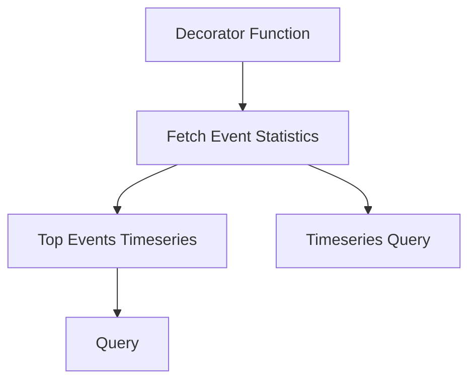

This document will cover the process of event statistics retrieval in the Sentry application. We'll cover:

1. The role of the Decorator function
2. The process of fetching event statistics
3. The role of the top_events_timeseries function
4. The role of the timeseries_query function
5. The role of the query function.

Technical document: <SwmLink doc-title="Understanding Decorators in Python">[Understanding Decorators in Python](/.swm/understanding-decorators-in-python.vhk9bpbz.sw.md)</SwmLink>

# The role of the Decorator function

The Decorator function is a crucial part of the Sentry application. It's designed to add new functionality to an existing object without modifying its structure. In the context of Sentry, the Decorator function is used to execute a function and handle any exceptions that might occur during its execution. If an exception is thrown, the Decorator function catches it and returns a response with an appropriate error message and status code. This ensures that the application can handle errors gracefully and provide useful feedback to the user.

# The process of fetching event statistics

Fetching event statistics is a complex process that involves several steps. First, the application checks if metrics are enhanced and if a dashboard widget ID is provided. If these conditions are not met, the application calls the \_get_event_stats function. If they are met, the application performs a series of operations to fetch and process event statistics based on the widget's configuration. This allows the application to provide users with detailed and relevant event statistics.

# The role of the top_events_timeseries function

The top_events_timeseries function is responsible for performing a timeseries query for a limited number of top events. If top events are not provided, the function calls the query function to fetch the top events. Then, it processes the results and returns them. This function is crucial for providing users with a snapshot of the most significant events in a given time series.

# The role of the timeseries_query function

The timeseries_query function performs a timeseries query against events. It creates an instance of the TimeseriesSpansMetricsQueryBuilder and runs the query. Then, it processes the results and returns them. This function is essential for retrieving event data over a specific period, allowing users to analyze trends and patterns in their event data.

# The role of the query function

The query function performs a query to fetch selected columns based on the provided query and parameters. It creates an instance of the SpansMetricsQueryBuilder and runs the query. Then, it processes the results and returns them. This function is crucial for fetching specific data from the event statistics, allowing users to focus on the data that is most relevant to their needs.

&nbsp;

*This is an auto-generated document by Swimm AI 🌊 and has not yet been verified by a human*

<SwmMeta version="3.0.0" repo-id="Z2l0aHViJTNBJTNBc2VudHJ5LWRlbW8lM0ElM0FTd2ltbS1EZW1v" repo-name="sentry-demo" doc-type="product-flows">Powered by [Swimm](/)</SwmMeta>
