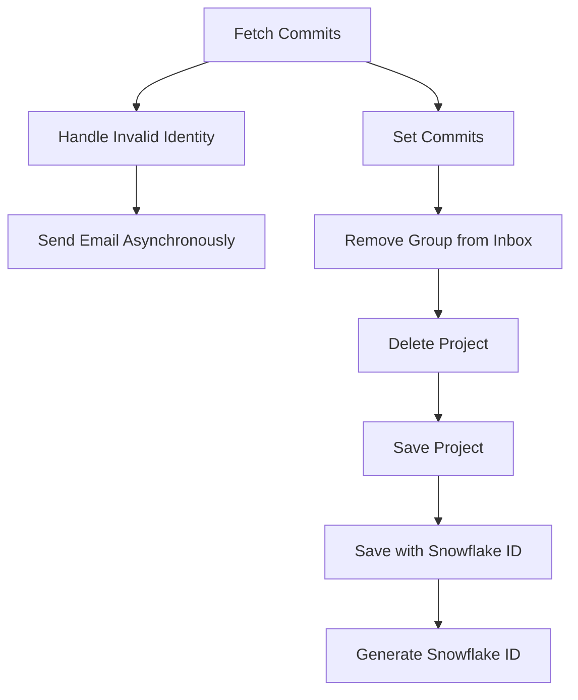

This document will cover the 'Fetch Commits Flow' in the Sentry application. We'll cover:

1. The purpose of the Fetch Commits Flow
2. The steps involved in the Fetch Commits Flow
3. The impact of each step on the end user.

Technical document: <SwmLink doc-title="Understanding the Fetch Commits Flow">[Understanding the Fetch Commits Flow](/.swm/understanding-the-fetch-commits-flow.tsq3pw6d.sw.md)</SwmLink>

# Fetch Commits

The Fetch Commits Flow begins with the 'fetch_commits' function. This function is responsible for fetching commits related to a release. It retrieves the release and user details, and then iterates over the provided refs to fetch commits from the repository. If any error occurs during this process, it is handled and logged accordingly. If the error is due to an invalid identity, the 'handle_invalid_identity' function is called. This step is crucial as it gathers all the necessary data for the release.

# Handle Invalid Identity

If an InvalidIdentity error is encountered during the fetch commits process, the 'handle_invalid_identity' function is called. This function generates an email to notify the user about the invalid identity and then deletes the invalid identity. This step ensures that users are informed about any issues with their identity and that invalid identities are removed from the system.

# Send Email Asynchronously

The 'send_async' function is used to send emails asynchronously. It is called within the 'handle_invalid_identity' function to send an email to the user about the invalid identity. It builds the email message and then queues it for sending. This step ensures that users are notified promptly about any issues with their identity.

# Set Commits

The 'set_commits' function is the next step in the flow. It binds a list of commits to a release, replacing any existing commit log. It also sorts the commit list in reverse order based on the timestamp. The function then processes each commit, creating or updating the corresponding 'Commit' and 'ReleaseCommit' objects. This step is crucial as it updates the release with the fetched commits.

# Remove Group from Inbox

The 'remove_group_from_inbox' function is the next step in the flow. It removes a group from the inbox. If the action is 'MARK_REVIEWED' and a user is provided, it creates an 'Activity' object and records the group history. This step ensures that the group is removed from the inbox after it has been reviewed.

# Delete Project

The 'delete' function is then called. It removes notification settings for the project and saves the project's state in the outbox before deleting the project. This step ensures that all related data is cleaned up before the project is deleted.

# Save Project

The 'save' function is the next step in the flow. It generates a slug for the project if it doesn't already have one. If the project uses a snowflake ID, it calls 'save_with_snowflake_id' to save the project with a snowflake ID. This step ensures that the project is saved with a unique identifier.

# Save with Snowflake ID

The 'save_with_snowflake_id' function is called next. It asserts that the model uses a snowflake ID, then tries to generate a snowflake ID and save the instance. If an 'IntegrityError' occurs, it resets the instance's ID and raises a 'MaxSnowflakeRetryError'. This step ensures that the project is saved with a unique snowflake ID.

# Generate Snowflake ID

The final step in the flow is the 'generate_snowflake_id' function. It generates a snowflake ID by combining various segment values, including a version ID, region ID, and time difference. It then validates the generated snowflake ID before returning it. This step ensures that a unique and valid snowflake ID is generated for the project.

&nbsp;

*This is an auto-generated document by Swimm AI 🌊 and has not yet been verified by a human*

<SwmMeta version="3.0.0" repo-id="Z2l0aHViJTNBJTNBc2VudHJ5LWRlbW8lM0ElM0FTd2ltbS1EZW1v" repo-name="sentry-demo" doc-type="product-flows">Powered by [Swimm](/)</SwmMeta>
