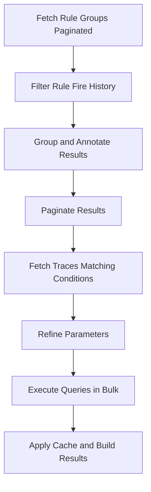

This document will cover the 'Fetch Rule Groups Paginated' feature in the Sentry application. We'll cover:

1. The purpose of the feature
2. The process of fetching rule groups in a paginated manner
3. The process of filtering rule fire history
4. The process of grouping and annotating results
5. The process of fetching traces that match certain conditions
6. The process of refining parameters and executing queries in bulk
7. The process of applying cache and building results.

Technical document: <SwmLink doc-title="Understanding fetch_rule_groups_paginated">[Understanding fetch_rule_groups_paginated](/.swm/understanding-fetch_rule_groups_paginated.gag7556u.sw.md)</SwmLink>

# Fetch Rule Groups Paginated

The 'Fetch Rule Groups Paginated' feature is a key part of the Sentry application. It is responsible for fetching rule groups in a paginated manner. This feature is used to manage and organize the rule groups in the application.

# Filter Rule Fire History

The feature filters the rule fire history based on the provided rule and date range. This allows the application to focus on the relevant rule groups within a specific time frame.

# Group and Annotate Results

The results are then grouped by group, and each group is annotated with count, event_id, and last_triggered. This provides a detailed overview of each rule group, including how many times it has been triggered, the last event it was triggered by, and when it was last triggered.

# Paginate Results

The results are then paginated using the 'OffsetPaginator'. This allows the application to handle large amounts of data efficiently by breaking it down into manageable chunks.

# Fetch Traces Matching Conditions

The feature then fetches traces that match certain conditions. This involves deciding which method to use for fetching traces based on the 'mri' attribute. If 'mri' is not None, it uses 'get_traces_matching_metric_conditions', otherwise it uses 'get_traces_matching_span_conditions'. This ensures that the application fetches the most relevant traces based on the given conditions.

# Refine Parameters and Execute Queries in Bulk

The parameters are then refined, and all queries are executed in bulk. This involves getting all queries, executing the queries in bulk, processing the results, and finally processing the final results. This process is efficient and allows the application to handle large amounts of data.

# Apply Cache and Build Results

Finally, the feature applies cache to the Snuba requests and builds the results. If caching is enabled, it checks the cache for each request and adds any misses to the query list. It then runs the queries and stores the results in the cache. This improves the performance of the application by reducing the need to re-fetch data.

&nbsp;

*This is an auto-generated document by Swimm AI 🌊 and has not yet been verified by a human*

<SwmMeta version="3.0.0" repo-id="Z2l0aHViJTNBJTNBc2VudHJ5LWRlbW8lM0ElM0FTd2ltbS1EZW1v" repo-name="sentry-demo" doc-type="product-flows">Powered by [Swimm](/)</SwmMeta>
