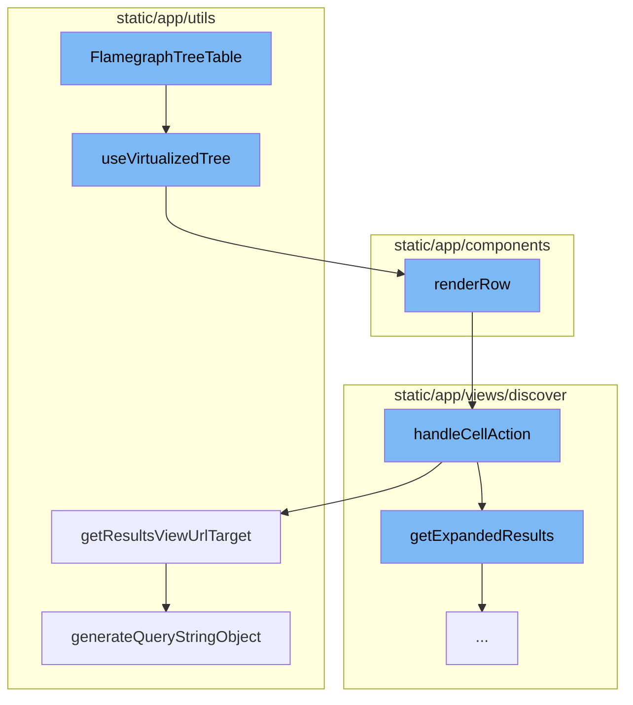

This document will cover the FlamegraphTreeTable feature, which includes:

1. Rendering a table representation of a flamegraph
2. Managing the state of the table
3. Handling user interactions
4. Generating URL target for the results view
5. Converting an aggregated query into one that does not have aggregates.

Technical document: <SwmLink doc-title="Understanding FlamegraphTreeTable">[Understanding FlamegraphTreeTable](/.swm/understanding-flamegraphtreetable.4v3j0cjn.sw.md)</SwmLink>

# Rendering a table representation of a flamegraph

The FlamegraphTreeTable function is a component that renders a table representation of a flamegraph. It takes in various properties such as the tree structure, expanded nodes, and callbacks for user interactions. It uses the useVirtualizedTree hook to manage the state of the table, including sorting, scrolling, and node expansion.

# Managing the state of the table

The useVirtualizedTree is a custom hook that manages the state of a virtualized tree structure. It handles actions such as scrolling, clicking, and expanding tree nodes. It also manages the rendering of rows in the tree.

# Handling user interactions

The renderRow method renders a row in the table. It takes in the row data, row index, column order, and table metadata. It maps over the column order to render each cell in the row. It also handles cell actions such as clicking and hovering.

# Generating URL target for the results view

The getResultsViewUrlTarget method generates the URL target for the results view. It takes in the organization slug and a boolean indicating whether it's the homepage. It returns an object containing the pathname and query parameters.

# Converting an aggregated query into one that does not have aggregates

The getExpandedResults function converts an aggregated query into one that does not have aggregates. It also applies additional conditions defined in additionalConditions and generates conditions based on the dataRow parameter and the current fields in the eventView.

&nbsp;

*This is an auto-generated document by Swimm AI 🌊 and has not yet been verified by a human*

<SwmMeta version="3.0.0" repo-id="Z2l0aHViJTNBJTNBc2VudHJ5LWRlbW8lM0ElM0FTd2ltbS1EZW1v" repo-name="sentry-demo" doc-type="product-flows">Powered by [Swimm](/)</SwmMeta>
