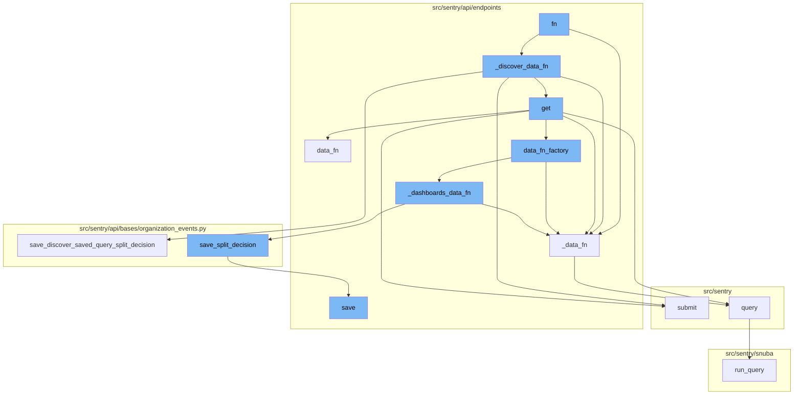

This document will cover the 'fn flow' feature, which includes:

1. The decision-making function 'fn'
2. The data retrieval process
3. The handling of the discovery of data
4. The processing of the message payload
5. The querying of tag data and facet performance
6. The saving of the decision of the dataset split
7. The production of billing outcomes
8. The flagging of the received metric for a project.

Technical document: <SwmLink doc-title="fn flow">[fn flow](/.swm/fn-flow.p4iuvw5c.sw.md)</SwmLink>

# The decision-making function 'fn'

The function 'fn' is a decision-making function that determines which data function to call based on certain conditions. It takes in parameters 'offset' and 'limit' and returns a dictionary. Depending on the conditions, it can call either the '\_discover_data_fn' or the '\_data_fn' function.

# The data retrieval process

The '\_data_fn' function is one of the possible functions that 'fn' can call. It takes in parameters 'scopedDataset', 'offset', 'limit', and 'query' and returns a dictionary. It is responsible for querying the scoped dataset with the provided parameters. The 'query' function is called within '\_data_fn'. It takes in a variety of parameters to build and run a query, and then processes the results. This function is a key part of the data retrieval process.

# Handling the discovery of data

The '\_discover_data_fn' function is responsible for handling the discovery of data. It takes in parameters such as the dataset, offset, limit, and query. It first tries to get the saved query from the database. If the widget has a split, it calls the '\_data_fn' function. If not, it infers the dataset from the query and saves the decision. If the dataset cannot be inferred, it runs both queries and saves the decision.

# Processing the message payload

The 'submit' function is used to process the message payload. It calls the '\_produce_billing_outcomes' and '\_flag_metric_received_for_project' functions to handle the payload.

# Querying tag data and facet performance

The 'data_fn' function is responsible for querying tag data and facet performance. It uses the 'query_tag_data' and 'query_facet_performance' functions to retrieve the necessary data.

# Saving the decision of the dataset split

The 'save_discover_saved_query_split_decision' function is used to save the decision of the dataset split. It takes in parameters such as the query, dataset inferred from the query, and whether there are errors or transactions. It saves the decision and returns it.

# Producing billing outcomes

The '\_produce_billing_outcomes' function is used to produce billing outcomes. It takes in a generic metric and counts the processed items. It then produces a billing outcome for each category.

# Flagging the received metric for a project

The '\_flag_metric_received_for_project' function is used to flag the received metric for a project. It takes in a generic metric and flags the metric if it is a custom metric and the project has not been updated yet.

&nbsp;

*This is an auto-generated document by Swimm AI 🌊 and has not yet been verified by a human*

<SwmMeta version="3.0.0" repo-id="Z2l0aHViJTNBJTNBc2VudHJ5LWRlbW8lM0ElM0FTd2ltbS1EZW1v" repo-name="sentry-demo" doc-type="product-flows">Powered by [Swimm](/)</SwmMeta>
