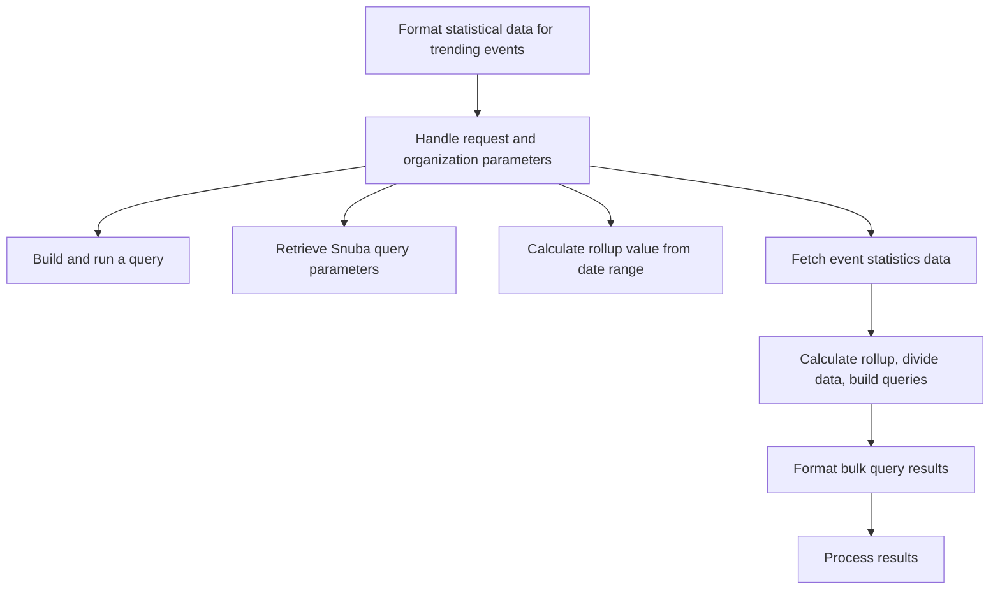

This document will cover the process of generating statistical data for trending events in Sentry. The process includes the following steps:

1. Formatting the statistical data for trending events.
2. Handling the request and organization parameters.
3. Building and running a query with the given parameters.
4. Retrieving the parameters needed for the Snuba query.
5. Calculating the rollup value based on the given date range.
6. Fetching event statistics data.
7. Calculating the rollup from the date range, dividing the data into chunks, and building queries for each chunk.
8. Formatting the results of the bulk queries.
9. Processing the results.

Technical document: <SwmLink doc-title="Understanding get_stats_data_for_trending_events">[Understanding get_stats_data_for_trending_events](/.swm/understanding-get_stats_data_for_trending_events.l4wvuyg3.sw.md)</SwmLink>

# Formatting the statistical data for trending events

The process begins by formatting the statistical data for trending events. This involves taking the results of the trending events, formatting them, and returning the formatted results. This step is crucial as it prepares the data for further processing.

# Handling the request and organization parameters

The next step involves handling the request and organization parameters. This is done by calling several other functions such as `get_event_stats`, `get_trends_data`, and `paginate_trending_events` to process the data. This step ensures that the data is correctly organized and ready for querying.

# Building and running a query with the given parameters

A query is then built and run with the given parameters. This involves using a query builder to construct the query and then processing the results. This step is crucial for retrieving the necessary data from the database.

# Retrieving the parameters needed for the Snuba query

The parameters needed for the Snuba query are then retrieved. This involves checking if the project_id is specified and raising an error if not. This step ensures that the query has all the necessary parameters to run successfully.

# Calculating the rollup value based on the given date range

The rollup value is then calculated based on the given date range. This value is used in the `get_event_stats` function to determine the granularity of the data. This step is crucial for ensuring that the data is aggregated at the correct level of detail.

# Fetching event statistics data

The event statistics data is then fetched. This involves taking in various parameters including the request, organization, and a callable `get_event_stats` function. It handles query errors, retrieves parameters from the request, and calls the `get_event_stats` function to fetch the event statistics. The results are then serialized and returned. This step is crucial for retrieving the necessary event statistics data.

# Calculating the rollup from the date range, dividing the data into chunks, and building queries for each chunk

The rollup is then calculated from the date range, the data is divided into chunks, and queries are built for each chunk. The queries are then executed in bulk and the results are formatted using the `format_top_events_timeseries_results` function. This step is crucial for processing the data in a manageable and efficient manner.

# Formatting the results of the bulk queries

The results of the bulk queries are then formatted. This involves checking if the results are empty and if so, returning a zero-filled series. Otherwise, the results are transformed, the order is added to the results using the top events, and the results are returned as a `SnubaTSResult`. This step is crucial for ensuring that the results are in a format that can be easily understood and used.

# Processing the results

Finally, the results are processed. This involves translating the columns, processing the field meta, and transforming the field results. The processed results are then returned. This step is crucial for ensuring that the results are in a format that can be easily understood and used.

&nbsp;

*This is an auto-generated document by Swimm AI 🌊 and has not yet been verified by a human*

<SwmMeta version="3.0.0" repo-id="Z2l0aHViJTNBJTNBc2VudHJ5LWRlbW8lM0ElM0FTd2ltbS1EZW1v" repo-name="sentry-demo" doc-type="product-flows">Powered by [Swimm](/)</SwmMeta>
