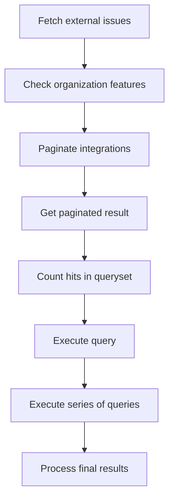

This document will cover the 'get_attrs' flow, which includes:

1. Fetching external issues related to a group of integrations.
2. Checking if the group's organization has the necessary features enabled.
3. Paginating the integrations for a specific organization.
4. Getting a paginated result.
5. Counting the number of hits in a queryset.
6. Executing a query and returning the data.
7. Executing a series of queries to get trace data.
8. Processing the final results of the trace data.

Technical document: <SwmLink doc-title="get_attrs flow">[get_attrs flow](/.swm/get_attrs-flow.m2a1e4rt.sw.md)</SwmLink>

# Fetching External Issues

The process begins by fetching external issues related to a group of integrations. This is done by querying the 'ExternalIssue' model to get issues linked to the group and the integrations in the list. These issues are then organized by their integration ID and a dictionary mapping each integration to its list of issues is returned.

# Checking Organization Features

Next, we check if the group's organization has the necessary features enabled. If not, an empty response is returned. If the features are enabled, we fetch the integrations that have either the ISSUE_BASIC or ISSUE_SYNC feature.

# Paginating Integrations

The integrations for a specific organization are then paginated. This is done by calling the 'do_hybrid_cloud_pagination' function which paginates the integrations.

# Getting Paginated Result

A paginated result is then obtained. This is done by building a queryset based on the cursor value, counting the hits if necessary, fetching the results, and returning a cursor with the results.

# Counting Hits in Queryset

The number of hits in a queryset is counted. This is done by creating a hits query from the queryset, executing the query, and returning the count of hits.

# Executing Query

A query is then executed and the data is returned. This is done by calling the '\_execute' function to get the data.

# Executing Series of Queries

A series of queries are executed to get trace data. This involves getting traces matching conditions, refining the parameters, getting all queries, executing the queries in bulk, processing the results, and returning the final data.

# Processing Final Results

Finally, the results of the trace data are processed. This involves taking the results of several queries as input, processing the data, and returning a list of trace results.

&nbsp;

*This is an auto-generated document by Swimm AI 🌊 and has not yet been verified by a human*

<SwmMeta version="3.0.0" repo-id="Z2l0aHViJTNBJTNBc2VudHJ5LWRlbW8lM0ElM0FTd2ltbS1EZW1v" repo-name="sentry-demo" doc-type="product-flows">Powered by [Swimm](/)</SwmMeta>
