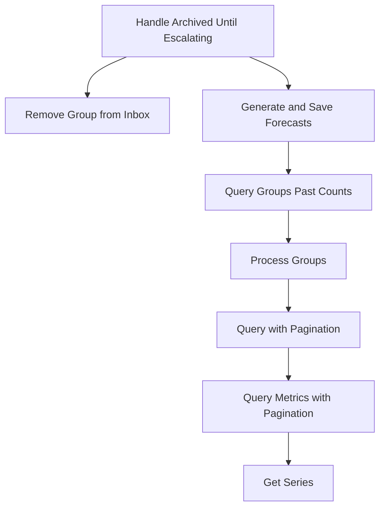

This document will cover the 'Handle Archived Until Escalating' feature, which includes:

 1. Understanding the purpose of the feature
 2. The process of handling issues that are archived until they escalate
 3. The process of removing a specific group from the inbox
 4. The process of deleting a project
 5. The process of generating and saving forecasts for each group
 6. The process of querying Snuba for the counts for every group bucketed into hours
 7. The process of querying Snuba for their hourly bucket count
 8. The process of querying Snuba for event counts for the given list of project ids and groups ids in a time range
 9. The process of paginating Snuba metric queries for event counts for the given list of project ids and groups ids in a time range
10. The process of getting time series for the given query.

Technical document: <SwmLink doc-title="Understanding handle_archived_until_escalating">[Understanding handle_archived_until_escalating](/.swm/understanding-handle_archived_until_escalating.uab2z03v.sw.md)</SwmLink>

# Understanding the 'Handle Archived Until Escalating' Feature

The 'Handle Archived Until Escalating' feature is responsible for managing issues that are archived until they escalate. It processes a list of groups, an acting user, a list of projects, and a sender. For each group in the list, it removes the group from the inbox and generates forecasts for the group list. It then sends a robust signal 'issue_archived' for each project with the list of groups belonging to that project.

# Handling Issues that are Archived Until They Escalate

When an issue is marked as ignored with 'archiveDuration: until_escalating' in the statusDetail, it is treated as 'archived_until_escalating'. This means that the issue is archived and will not be visible to the user until it escalates, i.e., until it becomes more severe or urgent. This helps in managing the issues effectively by focusing on the ones that need immediate attention.

# Removing a Specific Group from the Inbox

As part of managing the issues, each group in the list is removed from the inbox. If the action is 'MARK_REVIEWED' and a user is provided, an activity of type 'MARK_REVIEWED' is created for the group and the group history is recorded as 'REVIEWED'. This helps in keeping track of the actions taken on the group and the user who performed the action.

# Deleting a Project

In some cases, a project may need to be deleted. This involves removing notification settings for the project and updating the project's outbox before deletion. This ensures that all the related data is cleaned up properly when a project is deleted.

# Generating and Saving Forecasts for Each Group

Forecasts are generated and saved for each group. This involves filtering out groups that should not be escalated and then querying past counts for these groups. The past counts are then parsed and saved per group. This helps in predicting the future behavior of the groups based on their past data.

# Querying Snuba for the Counts for Every Group Bucketed into Hours

The counts for every group bucketed into hours are queried from Snuba. The query is optimized by ensuring that we look at group_ids that are from the same project id. This is important as the data in Snuba is stored in blocks related to the project id. This helps in retrieving the data efficiently.

# Querying Snuba for Their Hourly Bucket Count

The groups are organized by project and organization, and queried in batches to maximize the number of groups on the first page of results. This helps in retrieving the data efficiently and reduces the total number of Snuba queries.

# Querying Snuba for Event Counts for the Given List of Project IDs and Groups IDs in a Time Range

Snuba is queried for event counts for the given list of project ids and groups ids in a time range. The results are paginated to manage the data effectively.

# Paginating Snuba Metric Queries for Event Counts for the Given List of Project IDs and Groups IDs in a Time Range

The Snuba metric queries for event counts for the given list of project ids and groups ids in a time range are paginated. This helps in managing the data effectively and reduces the load on the system.

# Getting Time Series for the Given Query

Time series for the given query is retrieved. This involves querying Snuba for event counts for the given list of project ids and groups ids in a time range. This helps in analyzing the data over a period of time.

&nbsp;

*This is an auto-generated document by Swimm AI 🌊 and has not yet been verified by a human*

<SwmMeta version="3.0.0" repo-id="Z2l0aHViJTNBJTNBc2VudHJ5LWRlbW8lM0ElM0FTd2ltbS1EZW1v" repo-name="sentry-demo" doc-type="product-flows">Powered by [Swimm](/)</SwmMeta>
