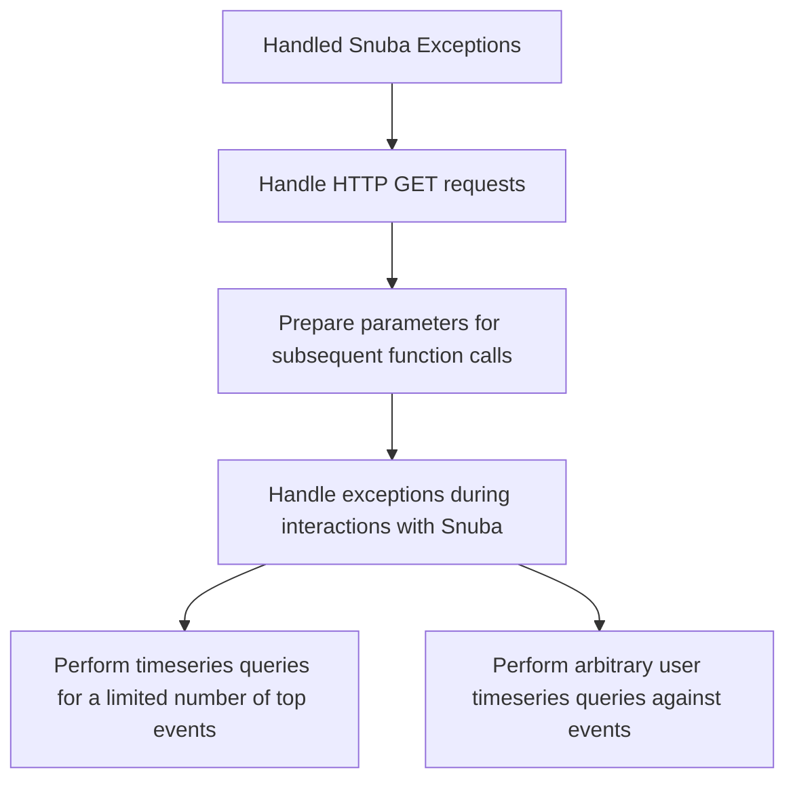

This document will cover the 'Handled Snuba Exceptions' feature of the Sentry application. We'll cover:

1. The purpose of the 'Handled Snuba Exceptions' feature
2. How the feature handles HTTP GET requests
3. How it prepares parameters for subsequent function calls
4. How it handles exceptions during interactions with Snuba
5. How it performs timeseries queries for a limited number of top events
6. How it performs arbitrary user timeseries queries against events.

Technical document: <SwmLink doc-title="Understanding handled_snuba_exceptions">[Understanding handled_snuba_exceptions](/.swm/understanding-handled_snuba_exceptions.jnple3xb.sw.md)</SwmLink>

# Purpose of the 'Handled Snuba Exceptions' feature

The 'Handled Snuba Exceptions' feature is a sequence of function calls that handle exceptions that occur during interactions with Snuba, a column-oriented, distributed data warehouse that Sentry uses for its event processing. The feature is designed to catch and handle any exceptions that occur during Snuba queries.

# Handling HTTP GET requests

The 'get' function is the entry point of the flow. It takes a request and an organization as parameters and returns a response. This function is responsible for handling the HTTP GET request and preparing the necessary parameters for the subsequent function calls in the flow.

# Preparing parameters for subsequent function calls

The '\_get_event_stats' function is called within the 'get' function. It takes several parameters including a dataset, query columns, a query string, parameters, a rollup, a boolean indicating whether to zerofill results, and a comparison delta. Depending on the number of top events, it either calls 'top_events_timeseries' or 'timeseries_query' functions from the 'scoped_dataset'.

# Handling exceptions during interactions with Snuba

The 'handled_snuba_exceptions' function is a decorator that wraps around another function, 'fn', and handles any exceptions that might occur during the execution of 'fn'. It catches various types of exceptions related to Snuba queries, such as 'DatasetSelectionError', 'QueryConnectionFailed', 'QueryExecutionTimeMaximum', and others. For each exception, it logs the error and returns a response with an appropriate error message and status code.

# Performing timeseries queries for a limited number of top events

The 'top_events_timeseries' function is used when there are top events to consider. It performs a timeseries query for a limited number of top events. If the number of top events equals the limit and 'include_other' is true, it also queries for other events.

# Performing arbitrary user timeseries queries against events

The 'timeseries_query' function is used when there are no top events to consider. It performs an arbitrary user timeseries query against events.

&nbsp;

*This is an auto-generated document by Swimm AI 🌊 and has not yet been verified by a human*

<SwmMeta version="3.0.0" repo-id="Z2l0aHViJTNBJTNBc2VudHJ5LWRlbW8lM0ElM0FTd2ltbS1EZW1v" repo-name="sentry-demo" doc-type="product-flows">Powered by [Swimm](/)</SwmMeta>
