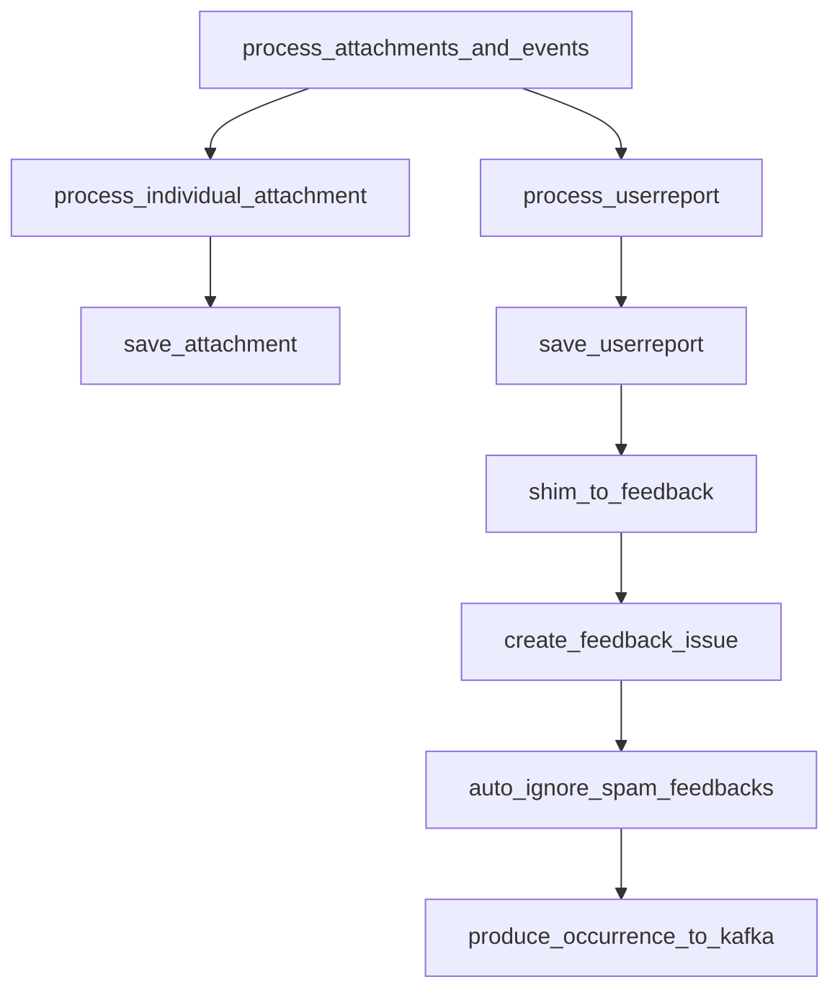

This document will cover the process of handling attachments and events in the Sentry error tracking and performance monitoring platform. We'll cover:

1. The entry point for processing attachments and events
2. Processing individual attachments
3. Saving attachments
4. Processing user reports
5. Saving user reports
6. Creating feedback from user reports
7. Creating feedback issues
8. Ignoring spam feedbacks
9. Producing occurrence to Kafka.

Technical document: <SwmLink doc-title="Understanding process_attachments_and_events">[Understanding process_attachments_and_events](/.swm/understanding-process_attachments_and_events.vwsn4gie.sw.md)</SwmLink>

# The entry point for processing attachments and events

The process begins with the `process_attachments_and_events` function. This function takes a raw message and a boolean flag. It decodes the actual event payload, which is in JSON format, performs some initial loadshedding on it, stores the JSON payload in the event processing store, and passes it on to the next step.

# Processing individual attachments

The `process_individual_attachment` function is called when the message type is 'attachment'. This function processes individual attachments which are not needed for event processing. It fetches the existing group_id, so that the attachment can be fetched by group-level APIs. Then, it retrieves the attachment from the cache and saves it if the attachment type is either 'event.attachment' or 'event.view_hierarchy'.

# Saving attachments

The `save_attachment` function is called to persist a cached event attachment into the file store. It emits one outcome, either ACCEPTED on success or INVALID(missing_chunks) if retrieving the attachment data fails. If the attachment is not rate-limited, it is stored and an ACCEPTED outcome is emitted.

# Processing user reports

The `process_userreport` function is the first step in the flow. It takes a message and a project as inputs. The function attempts to save the user report and returns a boolean indicating the success of the operation.

# Saving user reports

The `save_userreport` function saves the user report to the database. If the report already exists, it updates the existing report. If the report is associated with a group, it sends a notification.

# Creating feedback from user reports

The `shim_to_feedback` function takes user reports and creates a new User Feedback from it. It tries to grab as much information from the legacy user report and event to create the new feedback.

# Creating feedback issues

The `create_feedback_issue` function creates a new feedback issue. It checks if the feedback should be filtered, and if not, it prepares the feedback event and produces an occurrence to Kafka.

# Ignoring spam feedbacks

The `auto_ignore_spam_feedbacks` function is used to automatically ignore feedbacks that are identified as spam. It produces a status change to Kafka to set the status of the feedback to ignored.

# Producing occurrence to Kafka

The `produce_occurrence_to_kafka` function is the final step in the flow. It prepares the payload and sends it to Kafka. If the event stream is not running Kafka, it processes the message directly.

&nbsp;

*This is an auto-generated document by Swimm AI 🌊 and has not yet been verified by a human*

<SwmMeta version="3.0.0" repo-id="Z2l0aHViJTNBJTNBc2VudHJ5LWRlbW8lM0ElM0FTd2ltbS1EZW1v" repo-name="sentry-demo" doc-type="product-flows">Powered by [Swimm](/)</SwmMeta>
