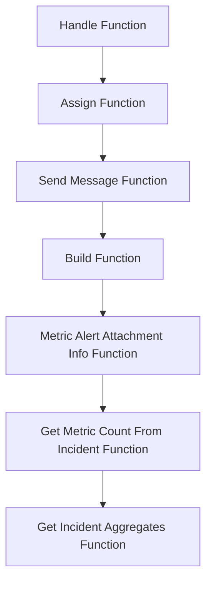

This document will cover the process of handling Discord message components in the Sentry application. We'll cover:

1. The entry point for handling Discord message components.
2. The process of assigning a user to a group.
3. The process of sending a follow-up message to Discord.
4. The process of building a dictionary with the alert rule, incident, new status, and metric value.
5. The process of generating information for the metric alert attachment.
6. The process of returning the current or last count of an incident aggregate.
7. The process of calculating aggregate stats across the life of an incident or the provided range.

Technical document: <SwmLink doc-title="Understanding the Handle Function">[Understanding the Handle Function](/.swm/understanding-the-handle-function.izmtq8h8.sw.md)</SwmLink>

# Handle Function

The Handle function is the entry point for handling Discord message components. It checks the custom_id of the request and calls the appropriate function based on the custom_id. For example, if the custom_id starts with `CustomIds.ASSIGN_DIALOG`, it calls the `assign_dialog` function. This function is crucial for directing the flow of the application based on the user's input.

# Assign Function

The Assign function is responsible for assigning a selected option to an assignee. It then updates the group with the assigned user and sends a message to Discord with the updated assignee information. This function is crucial for ensuring that the correct user is assigned to the group and that this information is communicated back to the user.

# Send Message Function

The Send Message function sends a follow-up message to Discord. The function takes a message and an optional update flag. If the message is a string, it is converted into a DiscordMessageBuilder object. The function then returns a response with the message data. This function is crucial for ensuring that the user is kept up to date with the status of their request.

# Build Function

The Build function builds a dictionary with the alert rule, incident, new status, and metric value. The function then constructs a URL and embeds it in the message. The function returns the built message. This function is crucial for ensuring that the correct information is included in the message that is sent to the user.

# Metric Alert Attachment Info Function

The Metric Alert Attachment Info function generates information for the metric alert attachment. The function takes an alert rule, an optional incident, new status, and metric value. It then calculates the status and constructs a URL for the alert details. The function returns a dictionary with the alert information. This function is crucial for ensuring that the correct information is included in the metric alert attachment.

# Get Metric Count From Incident Function

The Get Metric Count From Incident function returns the current or last count of an incident aggregate. The function takes an incident and returns the count of the incident aggregates. This function is crucial for ensuring that the correct count is returned for the incident aggregate.

# Get Incident Aggregates Function

The Get Incident Aggregates function calculates aggregate stats across the life of an incident or the provided range. The function takes an incident, optional start and end dates, and a windowed stats flag. It then runs a query to get the incident aggregates and returns the aggregated result. This function is crucial for ensuring that the correct aggregate stats are calculated for the incident.

&nbsp;

*This is an auto-generated document by Swimm AI 🌊 and has not yet been verified by a human*

<SwmMeta version="3.0.0" repo-id="Z2l0aHViJTNBJTNBc2VudHJ5LWRlbW8lM0ElM0FTd2ltbS1EZW1v" repo-name="sentry-demo" doc-type="product-flows">Powered by [Swimm](/)</SwmMeta>
