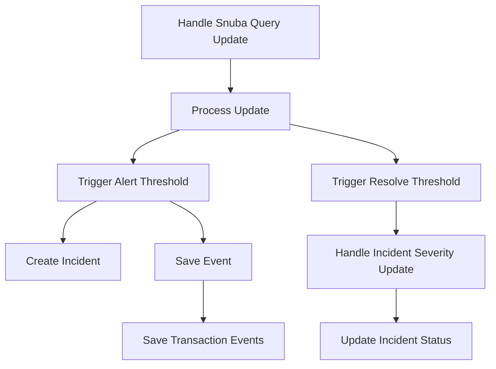

This document will cover the process of handling updates to a QuerySubscription in the Sentry application. We'll cover:

1. The entry point for handling updates to a QuerySubscription.
2. The core processing method used when the Query Subscription Consumer fetches updates.
3. The process when a subscription update exceeds the value defined in the alert threshold.
4. The creation of a new incident if we don't already have an active incident for the AlertRule.
5. The process of saving the event after normalizing and processing it.
6. The process when a subscription update exceeds the trigger resolve threshold and the trigger is currently active.
7. The handling of the update of incident severity.
8. The updating of the status of an incident and logging the change.
9. The saving of transaction events.

Technical document: <SwmLink doc-title="Understanding handle_snuba_query_update">[Understanding handle_snuba_query_update](/.swm/understanding-handle_snuba_query_update.cods88os.sw.md)</SwmLink>

# Handle Snuba Query Update

The process begins with the handling of updates to a QuerySubscription. This is the entry point for managing updates to a QuerySubscription. The SubscriptionProcessor is used to process the update.

# Process Update

The core processing method is utilized when the Query Subscription Consumer fetches updates. It checks the project and dataset, and if they exist and have the required features, it processes the update. It checks for alert rules and triggers them if the conditions are met.

# Trigger Alert Threshold

This function is called when a subscription update exceeds the value defined in the alert threshold, and the trigger hasn't already been activated. It increments the count of how many times we've consecutively exceeded the threshold, and if above the threshold period defined in the alert rule then mark the trigger as activated, and create an incident if there isn't already one.

# Create Incident

This function is used to create a new incident if we don't already have an active incident for the AlertRule. It sets the status of the incident to open and associates it with the alert rule.

# Save Event

This function is used to save the event after normalizing and processing it. It saves adjacent models such as releases and environments to postgres and writes the event into the eventstream. From there it will be picked up by Snuba and post-processing.

# Trigger Resolve Threshold

This function is invoked when a subscription update exceeds the trigger resolve threshold and the trigger is currently active. It increments the resolve count for the trigger and checks if it has reached the alert rule threshold. If so, it resolves the incident trigger and checks if all triggers are resolved. If all triggers are resolved, it updates the incident status to closed. Otherwise, it calls handle_incident_severity_update to handle the incident severity update.

# Handle Incident Severity Update

This function is used to handle the update of incident severity. It checks if there are any active incident triggers and updates the incident status based on the severity of the triggers.

# Update Incident Status

This function is used to update the status of an incident and log the change. If the status is closed, it sets the date closed to the current time and takes a snapshot of the current incident state.

# Save Transaction Events

This function is used to save transaction events. It creates releases, event users, derives plugin tags and interface tags, calculates span grouping, materializes metadata, creates environments, and inserts the events into the eventstream.

&nbsp;

*This is an auto-generated document by Swimm AI 🌊 and has not yet been verified by a human*

<SwmMeta version="3.0.0" repo-id="Z2l0aHViJTNBJTNBc2VudHJ5LWRlbW8lM0ElM0FTd2ltbS1EZW1v" repo-name="sentry-demo" doc-type="product-flows">Powered by [Swimm](/)</SwmMeta>
