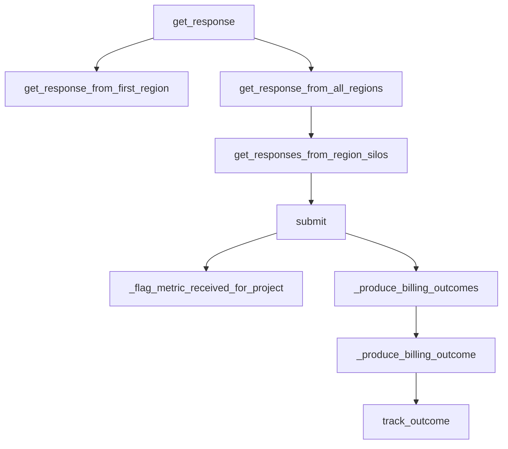

This document will cover the process of handling Slack Webhook Requests in the sentry-demo repo. We'll cover:

1. The entry point for handling Slack Webhook Requests
2. The decision-making process for handling requests
3. The process of handling requests by region
4. The process of submitting and tracking outcomes.

Technical document: <SwmLink doc-title="Understanding the get_response Function">[Understanding the get_response Function](/.swm/understanding-the-get_response-function.2h1qdcep.sw.md)</SwmLink>

# Entry Point for Handling Slack Webhook Requests

The process begins with the `get_response` function, which serves as the entry point for handling Slack Webhook Requests. This function first checks if the request is from a control class or an event challenge. If it is, it gets a response from the control silo. If not, it retrieves the regions from the organizations and based on the view class and action options, it decides whether to get a response from all regions or just the first one.

# Decision-Making Process for Handling Requests

The `get_response_from_first_region` function is called when the Slack webhook request needs to be handled by the first region only. It retrieves the regions from the organizations, gets the responses from the region silos for the first region, and returns the response. If there is an error, it raises a SiloClientError.

# Handling Requests by Region

The `get_response_from_all_regions` function retrieves responses from all regions by calling `get_responses_from_region_silos` with the regions obtained from `get_regions_from_organizations`. It then filters out successful responses and raises an error if there are none. The `get_responses_from_region_silos` function handles requests for a given list of regions. It uses a ThreadPoolExecutor to get responses from each region in parallel. The function returns a mapping of region names to responses or exceptions.

# Submitting and Tracking Outcomes

The `submit` function is called with a message as an argument. It extracts the payload from the message and calls `_produce_billing_outcomes` and `_flag_metric_received_for_project` with the payload. The `_flag_metric_received_for_project` function checks if the metric received is a custom metric. If it is, and if the metric flag for the project has not been updated yet, it sends a signal that the first custom metric was received and updates the cache. The `_produce_billing_outcomes` function counts the processed items from the generic metric and calls `_produce_billing_outcome` for each category and quantity. The `_produce_billing_outcome` function calls `track_outcome` with the organization id, project id, category, and quantity. It only proceeds if the quantity is greater than 0. The `track_outcome` function is a central point to track organization/project counters per incoming event. It sends the outcome message to Kafka which is used by Snuba to serve data for SnubaTSDB and RedisSnubaTSDB.

&nbsp;

*This is an auto-generated document by Swimm AI 🌊 and has not yet been verified by a human*

<SwmMeta version="3.0.0" repo-id="Z2l0aHViJTNBJTNBc2VudHJ5LWRlbW8lM0ElM0FTd2ltbS1EZW1v" repo-name="sentry-demo" doc-type="product-flows">Powered by [Swimm](/)</SwmMeta>
