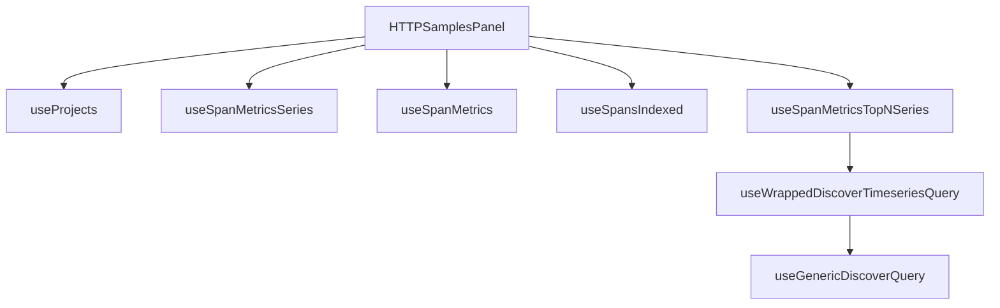

This document will provide an understanding of the HTTPSamplesPanel feature in the Sentry application. We'll cover:

1. The purpose of the HTTPSamplesPanel
2. How it fetches and manages data related to HTTP samples
3. How it handles user interactions such as panel changes and response code class changes
4. The use of various hooks and functions in the process.

Technical document: <SwmLink doc-title="Understanding HTTPSamplesPanel">[Understanding HTTPSamplesPanel](/.swm/understanding-httpsamplespanel.jvcuriqe.sw.md)</SwmLink>

# HTTPSamplesPanel

The HTTPSamplesPanel is a key component of the HTTP samples panel in the Sentry application. It fetches and manages data related to HTTP samples. This includes information about HTTP requests and responses, such as the request method, response code, and other related data. The HTTPSamplesPanel also handles user interactions, such as changes to the panel view and changes to the response code class.

# useProjects

The useProjects hook is used by the HTTPSamplesPanel to fetch project data from the ProjectsStore. This includes information about all the projects in the Sentry application. The useProjects hook also provides a way to select specific project slugs, and search for more projects that may not be in the project store.

# useSpanMetricsSeries

The useSpanMetricsSeries hook is used by the HTTPSamplesPanel to fetch span metrics series data. Span metrics series data includes information about the span of HTTP requests and responses. This data is used to provide insights into the performance of the HTTP requests and responses.

# useSpanMetrics

The useSpanMetrics hook is used by the HTTPSamplesPanel to fetch span metrics data. Span metrics data includes information about the span of HTTP requests and responses. This data is used to provide insights into the performance of the HTTP requests and responses.

# useSpansIndexed

The useSpansIndexed hook is used by the HTTPSamplesPanel to fetch spans indexed data. Spans indexed data includes information about the indexed spans of HTTP requests and responses. This data is used to provide insights into the performance of the HTTP requests and responses.

# useSpanMetricsTopNSeries

The useSpanMetricsTopNSeries hook is used by the HTTPSamplesPanel to fetch the top N series of span metrics. This includes the top N spans of HTTP requests and responses based on their performance. This data is used to provide insights into the performance of the top N HTTP requests and responses.

# useWrappedDiscoverTimeseriesQuery

The useWrappedDiscoverTimeseriesQuery hook is used by the HTTPSamplesPanel to fetch timeseries data from the Discover API. This includes timeseries data of HTTP requests and responses. This data is used to provide insights into the performance of the HTTP requests and responses over time.

# useGenericDiscoverQuery

The useGenericDiscoverQuery hook is used by the HTTPSamplesPanel to fetch data from the Discover API. This is a generic function that can be used to fetch any type of data from the Discover API. In the context of the HTTPSamplesPanel, it is used to fetch data related to HTTP samples.

&nbsp;

*This is an auto-generated document by Swimm AI 🌊 and has not yet been verified by a human*

<SwmMeta version="3.0.0" repo-id="Z2l0aHViJTNBJTNBc2VudHJ5LWRlbW8lM0ElM0FTd2ltbS1EZW1v" repo-name="sentry-demo" doc-type="product-flows">Powered by [Swimm](/)</SwmMeta>
