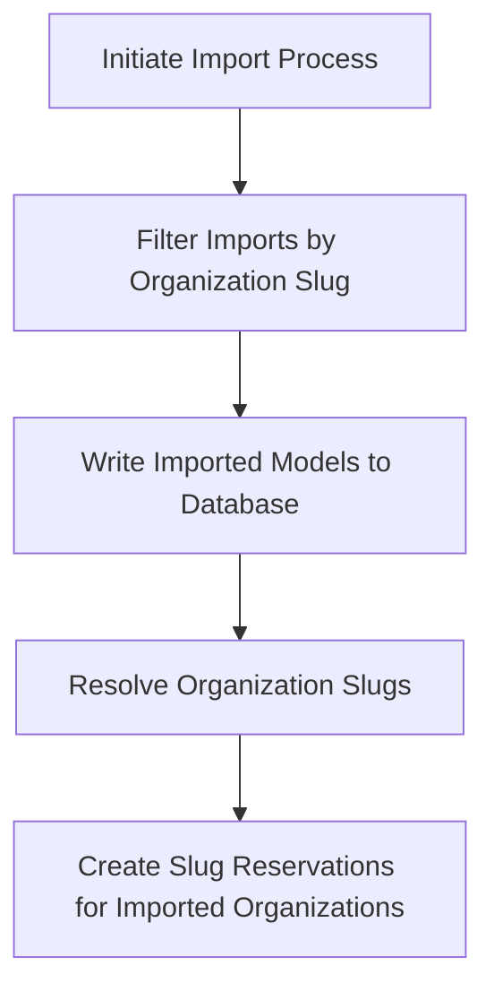

This document will cover the process of importing organizations in Sentry, which includes:

1. Initiating the import process
2. Filtering the imports by organization slug
3. Writing the imported models to the database
4. Resolving organization slugs
5. Creating slug reservations for imported organizations

Technical document: <SwmLink doc-title="Understanding the import_organizations Flow">[Understanding the import_organizations Flow](/.swm/understanding-the-import_organizations-flow.lti9mqsf.sw.md)</SwmLink>

# Initiating the Import Process

The import process is initiated by the `import_organizations` function. This function serves as the entry point for importing organizations. It takes a source file and various other parameters, and initiates the import process.

# Filtering the Imports by Organization Slug

The `import_in_organization_scope` function is responsible for importing models within the `Organization` scope. It filters the imports by organization slug if the `org_filter` argument is provided. This allows for selective import of organizations based on their slugs.

# Writing the Imported Models to the Database

The `_import` function is the core function that handles the import process. It reads the models from the source file, writes them to the database, and resolves organization slugs. The `do_writes` function is responsible for writing the imported models to the database. It skips over organization auth tokens, which are deferred for later processing.

# Resolving Organization Slugs

The `resolve_org_slugs_from_pk_map` function resolves the slugs for all imported organization models and reconciles their slug globally by issuing a slug update. This ensures that the organization slugs are unique and correctly mapped to their respective organizations.

# Creating Slug Reservations for Imported Organizations

The `bulk_create_organization_slugs` function is used to bulk create slug reservations for imported organizations that already exist on the region. The `bulk_create_organization_slug_reservations` function is used to bulk create organization slug reservations. It creates slug reservations for each organization in the slug mapping. This ensures that the organization slugs are reserved and cannot be used by other organizations.

&nbsp;

*This is an auto-generated document by Swimm AI 🌊 and has not yet been verified by a human*

<SwmMeta version="3.0.0" repo-id="Z2l0aHViJTNBJTNBc2VudHJ5LWRlbW8lM0ElM0FTd2ltbS1EZW1v" repo-name="sentry-demo" doc-type="product-flows">Powered by [Swimm](/)</SwmMeta>
