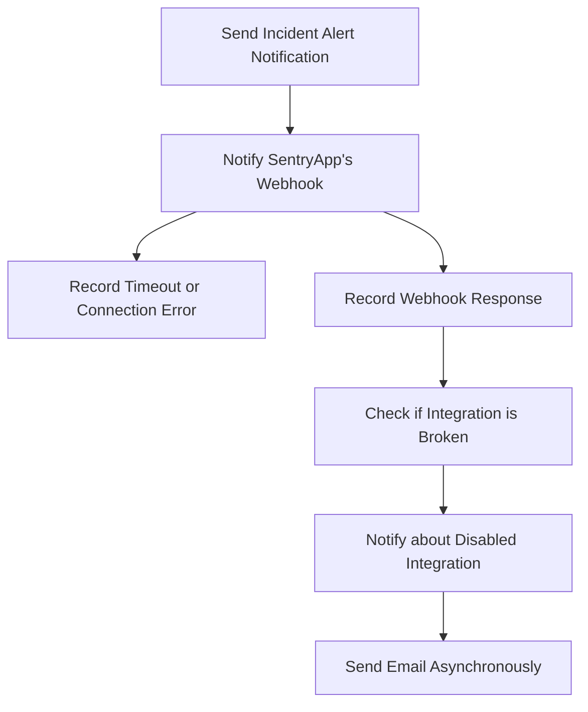

This document will cover the Incident Alert Notification Flow in Sentry, which includes:

1. Sending an incident alert notification
2. Notifying a SentryApp's webhook about an incident and logging the response
3. Recording a timeout or connection error
4. Recording the response of a webhook request
5. Checking if the integration is broken
6. Notifying the owners of the organization about the disabled integration
7. Sending the email message asynchronously.

Technical document: <SwmLink doc-title="Incident Alert Notification Flow">[Incident Alert Notification Flow](/.swm/incident-alert-notification-flow.cj3n3azh.sw.md)</SwmLink>

# Sending an Incident Alert Notification

The process begins with sending a notification about an incident alert. This involves retrieving the SentryApp and SentryAppInstallation objects based on the provided IDs. If either does not exist, an error is logged and the process ends. If they do exist, an AppPlatformEvent object is created and a webhook request is sent.

# Notifying a SentryApp's Webhook

The next step is to notify a SentryApp's webhook about the incident and log the response. This involves sending a request to the webhook URL and handling various response scenarios. If the response status code indicates a timeout or connection error, a timeout is recorded.

# Recording a Timeout or Connection Error

If a timeout or connection error occurs, it is recorded in the integration buffer to check if the SentryApp is broken and should be disabled. The buffer is updated and a check is made to see if the integration is broken.

# Recording the Response of a Webhook Request

The response of a webhook request is recorded. If the response is successful, the success is recorded. If the response is an error, the error is recorded and a check is made to see if the integration is broken.

# Checking if the Integration is Broken

If the integration is broken, the Sentry app is disabled and a notification is sent about the disabled integration.

# Notifying about Disabled Integration

The owners of the organization are notified about the disabled integration. A message with the necessary information is built and sent asynchronously.

# Sending the Email Message Asynchronously

Finally, the email message is sent asynchronously. The email message is built and sent using the appropriate email task.

&nbsp;

*This is an auto-generated document by Swimm AI 🌊 and has not yet been verified by a human*

<SwmMeta version="3.0.0" repo-id="Z2l0aHViJTNBJTNBc2VudHJ5LWRlbW8lM0ElM0FTd2ltbS1EZW1v" repo-name="sentry-demo" doc-type="product-flows">Powered by [Swimm](/)</SwmMeta>
