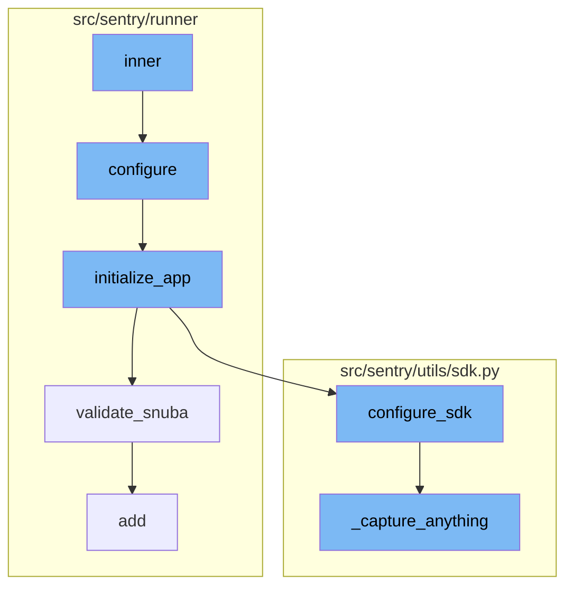

This document will cover the inner function flow of the Sentry application, which includes:

1. The initialization of the application
2. The configuration of the application
3. The validation of Snuba
4. The addition of user permissions
5. The configuration of the SDK
6. The capturing of events and metrics.

Technical document: <SwmLink doc-title="Understanding the Inner Function Flow">[Understanding the Inner Function Flow](/.swm/understanding-the-inner-function-flow.obimnvm8.sw.md)</SwmLink>

# Initialization of the Application

The application starts with the 'inner' function which checks if the application is in a state that allows configuration. If it is, the 'configure' function is called to set up the environment.

# Configuration of the Application

The 'configure' function sets up the environment using two different config files. It ensures that warnings are always displayed, adds additional mimetypes for static files, checks if the config files exist, and sets up autoreload for the config.yml file if needed. It also sets the 'DJANGO_SETTINGS_MODULE' environment variable and calls the 'initialize_app' function.

# Validation of Snuba

The 'validate_snuba' function ensures that everything related to Snuba is in sync. It checks if all Snuba required backends are set and if the eventstream is Snuba compatible. It also checks if any features that require Snuba are enabled and if they are, it ensures that Snuba is correctly configured.

# Addition of User Permissions

The 'add' function is used to add a permission to a user. It creates a 'UserPermission' object and saves it to the database. If the permission already exists for the user, it informs the user about it.

# Configuration of the SDK

The 'configure_sdk' function sets up and initializes the Sentry SDK. It gets the SDK options and checks if the 'sentry4sentry_transport' and 'sentry_saas_transport' are available. If they are, it patches the transport for instrumentation and increments the internal captured events upstream.

# Capturing of Events and Metrics

The '\_capture_anything' function is responsible for capturing events and metrics. It checks if the 'sentry4sentry_transport' is available and if so, it increments the internal captured events upstream. It then checks if the 'SENTRY_SDK_UPSTREAM_METRICS_ENABLED' setting is disabled and the method name is 'capture_envelope', if so, it filters out all the statsd envelope items, which contain custom metrics sent by the SDK, unless they are allowed via a separate sample rate. Finally, it checks if the 'sentry_saas_transport' is available and if the current event is safe, if so, it increments the internal captured events relay.

&nbsp;

*This is an auto-generated document by Swimm AI 🌊 and has not yet been verified by a human*

<SwmMeta version="3.0.0" repo-id="Z2l0aHViJTNBJTNBc2VudHJ5LWRlbW8lM0ElM0FTd2ltbS1EZW1v" repo-name="sentry-demo" doc-type="product-flows">Powered by [Swimm](/)</SwmMeta>
