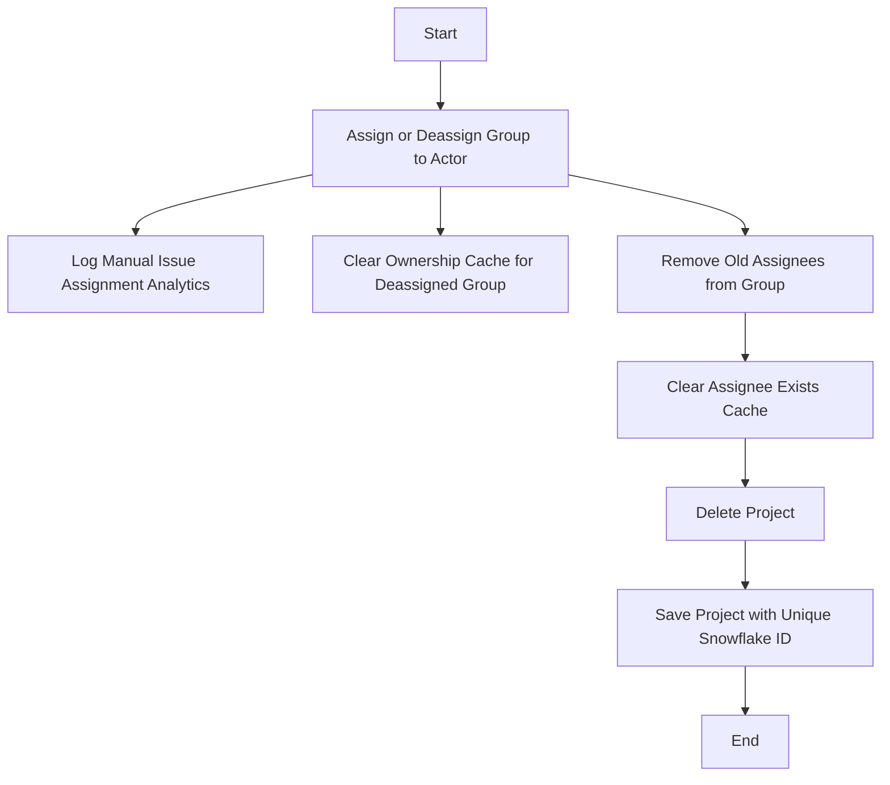

This document will cover the 'Issue Assignment Management' flow in Sentry, which includes:

1. Assigning or deassigning a group to an actor
2. Logging the manual issue assignment analytics
3. Clearing the ownership cache for the deassigned group
4. Removing the previous assignee from the group
5. Clearing the assignee exists cache
6. Deleting a project
7. Saving a project with a unique snowflake ID.

Technical document: <SwmLink doc-title="Understanding the handle_assigned_to Flow">[Understanding the handle_assigned_to Flow](/.swm/understanding-the-handle_assigned_to-flow.ko740vua.sw.md)</SwmLink>

# Assigning or Deassigning a Group to an Actor

The first step in the 'Issue Assignment Management' flow is to assign or deassign a group to an actor. This could be a user or a team. If an actor is assigned, the actor is resolved and assigned to each group in the group list. If no actor is assigned, the group is deassigned.

# Logging the Manual Issue Assignment Analytics

After the assignment or deassignment process, the system logs the manual issue assignment analytics. This helps in tracking the assignment activities and provides valuable insights for future reference.

# Clearing the Ownership Cache for Deassigned Group

When a group is deassigned, the system clears the ownership cache for that group. This ensures that the system does not hold any outdated information about the group's ownership.

# Removing the Previous Assignee from the Group

As part of the deassignment process, the system removes the previous assignee from the group. However, if the new assignee is a team that the old assignee (a user) is in, they are not removed. This ensures that the group's assignment information is always up-to-date.

# Clearing the Assignee Exists Cache

The system also clears the assignee exists cache. If a group ID is provided, the cache for that specific group is cleared. Otherwise, the cache for all groups within a project that had an event within a certain time window is cleared. This helps in maintaining the accuracy of the assignee information.

# Deleting a Project

In some cases, a project may need to be deleted. The system manually cascades the deletion due to the lack of a foreign key relationship. It also removes notification settings for the project. This ensures that the system does not hold any unnecessary data.

# Saving a Project with a Unique Snowflake ID

Finally, the system saves a project with a unique snowflake ID. If the project doesn't have a slug, it generates one. This unique ID helps in identifying the project in the system.

&nbsp;

*This is an auto-generated document by Swimm AI 🌊 and has not yet been verified by a human*

<SwmMeta version="3.0.0" repo-id="Z2l0aHViJTNBJTNBc2VudHJ5LWRlbW8lM0ElM0FTd2ltbS1EZW1v" repo-name="sentry-demo" doc-type="product-flows">Powered by [Swimm](/)</SwmMeta>
