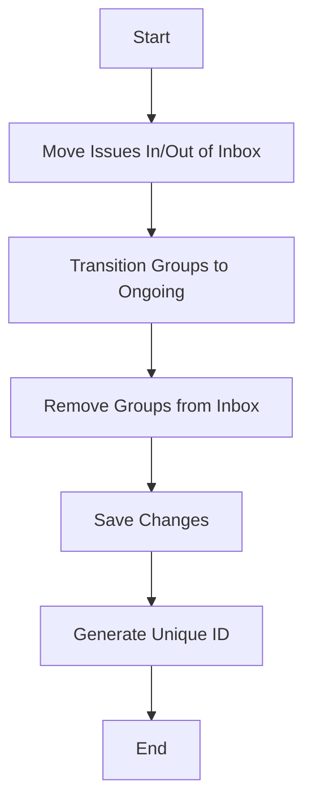

This document will provide a detailed explanation of the 'Issue Management Flow' in the Sentry application. We'll cover:

1. The purpose of the flow
2. The process of moving issues in or out of the inbox
3. The transition of groups to ongoing status
4. The removal of groups from the inbox
5. The process of saving changes and generating unique IDs.

Technical document: <SwmLink doc-title="Understanding the update_inbox Function">[Understanding the update_inbox Function](/.swm/understanding-the-update_inbox-function.djq8mfrz.sw.md)</SwmLink>

# Purpose of the Issue Management Flow

The 'Issue Management Flow' is a key part of the Sentry application's issue management system. It is responsible for efficiently handling large numbers of issues, moving them in or out of the inbox based on user actions.

# Moving Issues In or Out of the Inbox

The process begins with determining whether groups of issues should be in the inbox or not. If the groups should be in the inbox, each group is added to the inbox. If the groups should not be in the inbox, each group is removed from the inbox. If a group's status is unresolved and its substatus is not ongoing, it is transitioned to ongoing.

# Transitioning Groups to Ongoing

When groups need to be transitioned to ongoing, the system filters the groups that need to be transitioned based on their id, status, and substatus. Then, it updates the status and substatus of these groups to 'unresolved' and 'ongoing' respectively.

# Removing Groups from Inbox

The system removes the groups from the inbox by filtering the GroupInbox objects that are in the groups and then deleting them.

# Saving Changes and Generating Unique IDs

The system saves the changes made to the groups. If the SENTRY_USE_SNOWFLAKE setting is true, it calls a function to generate a unique ID for the instance. This function creates a dictionary of segment values and then uses these values to create the snowflake ID. The function validates the ID before returning it.

&nbsp;

*This is an auto-generated document by Swimm AI 🌊 and has not yet been verified by a human*

<SwmMeta version="3.0.0" repo-id="Z2l0aHViJTNBJTNBc2VudHJ5LWRlbW8lM0ElM0FTd2ltbS1EZW1v" repo-name="sentry-demo" doc-type="product-flows">Powered by [Swimm](/)</SwmMeta>
