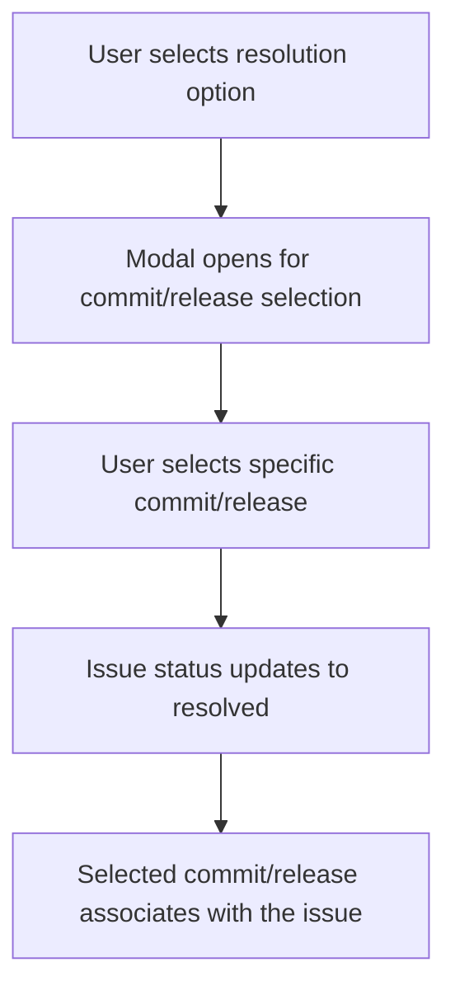

This document will provide an in-depth understanding of the 'ResolveActions' feature in Sentry. We'll cover:

1. The purpose of ResolveActions
2. The process of resolving issues by a specific commit or by an existing release
3. The user interaction with the resolution options
4. The impact of the user's choice on the issue's status.

Technical document: <SwmLink doc-title="Understanding ResolveActions">[Understanding ResolveActions](/.swm/understanding-resolveactions.uojxfa4y.sw.md)</SwmLink>

# Purpose of ResolveActions

ResolveActions is a feature that manages the resolution of issues in Sentry. It provides different resolution options to the user, such as resolving by a specific commit or by an existing release. The user's choice triggers a specific action that updates the issue's status to resolved and associates it with the selected commit or release.

# Resolving Issues by a Specific Commit or by an Existing Release

The ResolveActions feature contains several helper functions that handle different resolution scenarios. These include resolving by a specific commit or by an existing release. When the user selects one of these options, a modal opens that allows the user to select the specific commit or release for issue resolution.

# User Interaction with the Resolution Options

The user interacts with the ResolveActions feature through a dropdown menu that presents different resolution options. Each option is associated with a specific action that will be triggered upon selection. For example, selecting the 'Another existing release' option triggers the 'openCustomReleaseModal' function, which opens a modal for the user to select a specific release. Similarly, selecting the 'A commit' option triggers the 'openCustomCommitModal' function, which opens a modal for the user to select a specific commit.

# Impact of the User's Choice on the Issue's Status

The user's choice of resolution option has a direct impact on the issue's status. When a specific commit or release is selected, the issue's status is updated to resolved and the selected commit or release is associated with the issue. This update operation is performed by the 'bulkUpdate' function, which is the final step in the ResolveActions flow.

&nbsp;

*This is an auto-generated document by Swimm AI 🌊 and has not yet been verified by a human*

<SwmMeta version="3.0.0" repo-id="Z2l0aHViJTNBJTNBc2VudHJ5LWRlbW8lM0ElM0FTd2ltbS1EZW1v" repo-name="sentry-demo" doc-type="product-flows">Powered by [Swimm](/)</SwmMeta>
