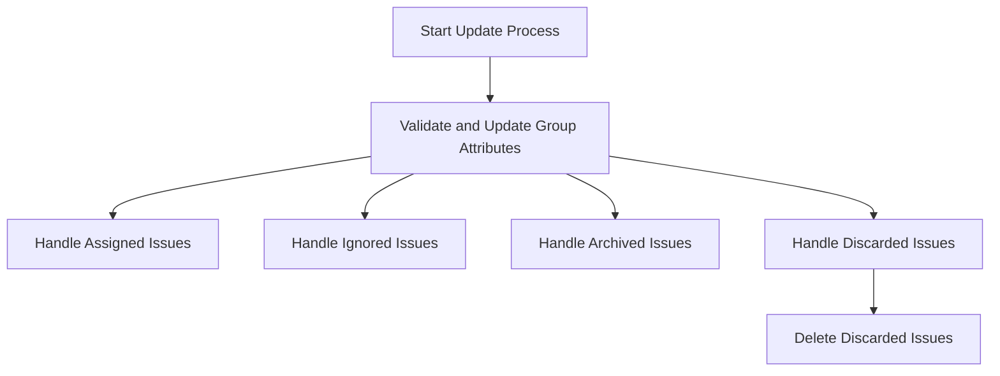

This document will cover the process of updating an issue's attributes in the Sentry application. We'll cover:

1. The initiation of the update process
2. The validation and update of group attributes
3. The handling of different issue states such as assigned, ignored, archived, and discarded
4. The final deletion of discarded issues.

Technical document: <SwmLink doc-title="put">[put](/.swm/understanding-the-put-function.nzrdsua9.sw.md)</SwmLink>

# Start Update Process

The update process begins when a request to update an issue's attributes is received. The system checks if the 'discard' attribute is present in the request data. If it is, or if the response status code is not 200, the process ends and the response is returned. Otherwise, the system fetches the updated group object and serializes it before returning it in the response.

# Validate and Update Group Attributes

The system validates the data in the request, checks if the group should be discarded, and updates the group's status and other attributes accordingly. This includes the group's ID, the projects it belongs to, and the organization ID.

# Handle Assigned Issues

If the issue is assigned to a user or a team, the system sets a new assignee or removes existing assignees. This is logged as a manual issue assignment.

# Handle Ignored Issues

If the issue is ignored, the system creates a snooze for it. Ignored issues are evaluated according to their status details and a snooze is created as needed.

# Handle Archived Issues

If the issue is archived, the system creates a forecast for it. Issues that are marked as ignored with 'archiveDuration: until_escalating' in the status detail are treated as 'archived_until_escalating'.

# Handle Discarded Issues

If the issue is discarded, the system creates a tombstone for it. A tombstone is a record that the issue was discarded. The system updates the group hashes accordingly.

# Delete Discarded Issues

Finally, if the issue is discarded, the system permanently removes it. The status of the groups is updated to 'PENDING_DELETION', the deletion process in the event stream is started, and the 'delete_groups_task' is scheduled to be executed after a delay.

&nbsp;

*This is an auto-generated document by Swimm AI 🌊 and has not yet been verified by a human*

<SwmMeta version="3.0.0" repo-id="Z2l0aHViJTNBJTNBc2VudHJ5LWRlbW8lM0ElM0FTd2ltbS1EZW1v" repo-name="sentry-demo" doc-type="product-flows">Powered by [Swimm](/)</SwmMeta>
