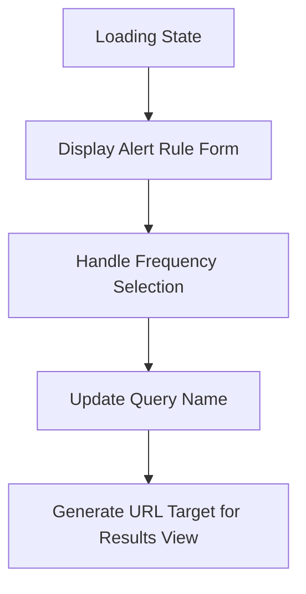

This document will cover the 'Loading and Displaying Alerts' feature in the Sentry application. We'll cover:

1. The loading state of the application
2. Displaying the alert rule form
3. Handling frequency selection
4. Updating the query name
5. Generating the URL target for the results view.

Technical document: <SwmLink doc-title="Understanding the renderLoading Function">[Understanding the renderLoading Function](/.swm/understanding-the-renderloading-function.0zt09n04.sw.md)</SwmLink>

# Loading State

When the application is in a loading state, a loading screen is displayed to the user. This is to ensure that the user is aware that data is being fetched and processed.

# Displaying the Alert Rule Form

The main body of the alert rule view is constructed, which includes environment selection, condition setting, filter setting, and action setting. This form allows the user to create and manage alert rules.

# Handling Frequency Selection

The application provides a dropdown menu for frequency selection. When a frequency is selected, the application checks if the new frequency is different from the old one. If it is, the application updates the frequency.

# Updating the Query Name

When a new frequency is selected, the application checks if the new query name is different from the old one. If it is, the application updates the query name in the database.

# Generating the URL Target for Results View

The application generates a URL target for the results view. This URL target is used to direct the user to the results view page.

&nbsp;

*This is an auto-generated document by Swimm AI 🌊 and has not yet been verified by a human*

<SwmMeta version="3.0.0" repo-id="Z2l0aHViJTNBJTNBc2VudHJ5LWRlbW8lM0ElM0FTd2ltbS1EZW1v" repo-name="sentry-demo" doc-type="product-flows">Powered by [Swimm](/)</SwmMeta>
