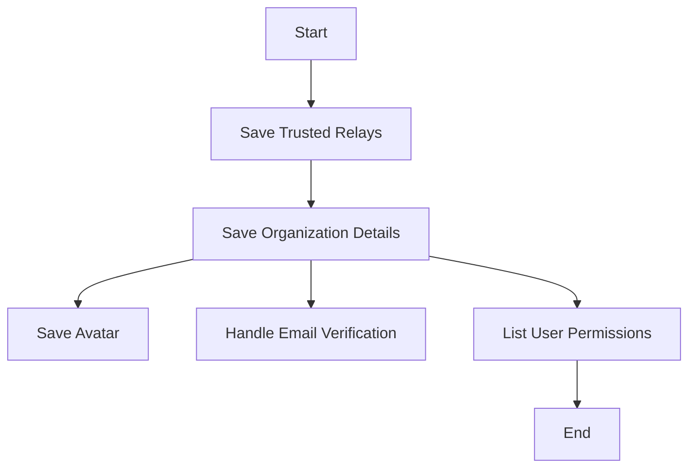

This document will cover the process of managing trusted relays in Sentry. We'll cover:

1. What is the purpose of trusted relays
2. How we save trusted relays
3. How we handle changes in trusted relays
4. How we handle organization details and avatar
5. How we handle email verification requirements
6. How we handle user permissions

Technical document: <SwmLink doc-title="Understanding the save_trusted_relays Function">[Understanding the save_trusted_relays Function](/.swm/understanding-the-save_trusted_relays-function.jzqwtucp.sw.md)</SwmLink>

# Purpose of Trusted Relays

Trusted relays are a crucial part of the Sentry application. They are used to ensure that only trusted sources can send events to your Sentry installation. This is particularly important for organizations that need to ensure the integrity and confidentiality of their data.

# Saving Trusted Relays

When an organization wants to add or update their trusted relays, we first check if there are existing trusted relays for the organization. If there are, we update the existing relays with the new ones. If there are no existing relays, we create new ones. Any changes made to the trusted relays are logged for auditing purposes.

# Handling Changes in Trusted Relays

Changes in trusted relays are handled by the 'save' function. This function checks if there are changes in the organization's data and updates the data accordingly. If there are changes in the trusted relays, it calls the 'save_trusted_relays' function to handle the changes.

# Saving Organization Details and Avatar

The 'save' function is also responsible for saving other organization details, including the organization's avatar. If there are changes in the avatar data, the 'save_avatar' function is called to handle these changes.

# Handling Email Verification Requirements

If the 'requireEmailVerification' flag is set to true, the 'handle_email_verification_required' function is called within the 'save' function. This function handles the requirement for email verification.

# Handling User Permissions

User permissions are handled by the 'list' function. This function lists the permissions for a user. It is not directly related to the 'save_trusted_relays' function but provides context on how permissions are handled in the codebase.

&nbsp;

*This is an auto-generated document by Swimm AI 🌊 and has not yet been verified by a human*

<SwmMeta version="3.0.0" repo-id="Z2l0aHViJTNBJTNBc2VudHJ5LWRlbW8lM0ElM0FTd2ltbS1EZW1v" repo-name="sentry-demo" doc-type="product-flows">Powered by [Swimm](/)</SwmMeta>
