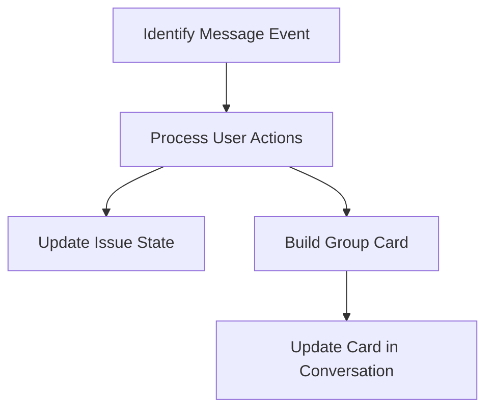

This document will cover the process of handling message events in Sentry, which includes:

1. Identifying the type of message event
2. Processing user actions
3. Updating the state of the issue
4. Building a group card
5. Updating the card in the conversation.

Technical document: <SwmLink doc-title="Handling Message Events in Sentry">[Handling Message Events in Sentry](/.swm/handling-message-events-in-sentry.axyws6ib.sw.md)</SwmLink>

# Identifying the Type of Message Event

The process begins by identifying the type of message event. This is crucial as it determines the subsequent steps. If the event is a user submitting an option on a card, the handling is delegated to processing user actions. If the conversation type is 'channel', it is handled differently than a 'personal' message.

# Processing User Actions

When a user submits an action, the system extracts necessary data from the request, validates the integration, group, and identity. If the identity is not found, it sends a linking card to the user. If the identity is found, it updates the state of the issue, refreshes the group from the database, builds a group card, and updates the card.

# Updating the State of the Issue

The state of the issue is updated based on the user's action. This involves recording an analytics event and sending a request to update the issue.

# Building a Group Card

A group card is built for the issue. The card includes the issue title, description, footer block, assignee details, and a set of actions.

# Updating the Card in the Conversation

The final step is to update the card in the conversation. This involves preparing the payload and sending the update.

&nbsp;

*This is an auto-generated document by Swimm AI 🌊 and has not yet been verified by a human*

<SwmMeta version="3.0.0" repo-id="Z2l0aHViJTNBJTNBc2VudHJ5LWRlbW8lM0ElM0FTd2ltbS1EZW1v" repo-name="sentry-demo" doc-type="product-flows">Powered by [Swimm](/)</SwmMeta>
