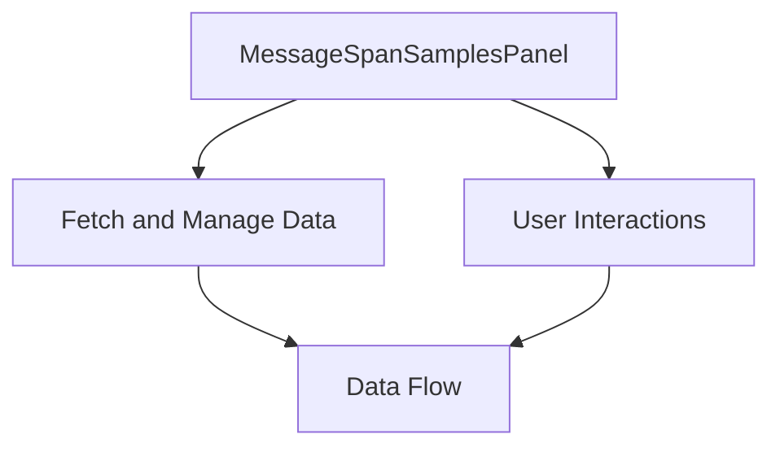

This document will cover the 'MessageSpanSamplesPanel' feature of the Sentry application. We'll cover:

1. The purpose of the MessageSpanSamplesPanel
2. How data is fetched and managed
3. The user interactions and their effects
4. The flow of data and its impact on the end user.

Technical document: <SwmLink doc-title="Understanding MessageSpanSamplesPanel">[Understanding MessageSpanSamplesPanel](/.swm/understanding-messagespansamplespanel.5bmmwb8x.sw.md)</SwmLink>

# Purpose of the MessageSpanSamplesPanel

The MessageSpanSamplesPanel is a key component of the Sentry application. It serves as the main interface for users to interact with and view data related to their projects. It provides a comprehensive view of the data, allowing users to understand the performance and status of their projects at a glance.

# Fetching and Managing Data

The MessageSpanSamplesPanel fetches and manages data related to the user's projects. This includes metrics data related to queues, project data, span samples data, and supported tags for span fields. The data is fetched using various custom hooks, ensuring that the most up-to-date and relevant data is always displayed to the user.

# User Interactions

The MessageSpanSamplesPanel allows users to interact with the data in various ways. This includes changing the trace status and retry count. These interactions allow users to customize the view and focus on the data that is most relevant to them.

# Data Flow and its Impact on the End User

The data flow in the MessageSpanSamplesPanel is designed to provide the most relevant and up-to-date information to the user. The data is fetched and managed in a way that ensures the user always has access to the latest data. This allows users to make informed decisions based on the current status and performance of their projects.

&nbsp;

*This is an auto-generated document by Swimm AI 🌊 and has not yet been verified by a human*

<SwmMeta version="3.0.0" repo-id="Z2l0aHViJTNBJTNBc2VudHJ5LWRlbW8lM0ElM0FTd2ltbS1EZW1v" repo-name="sentry-demo" doc-type="product-flows">Powered by [Swimm](/)</SwmMeta>
