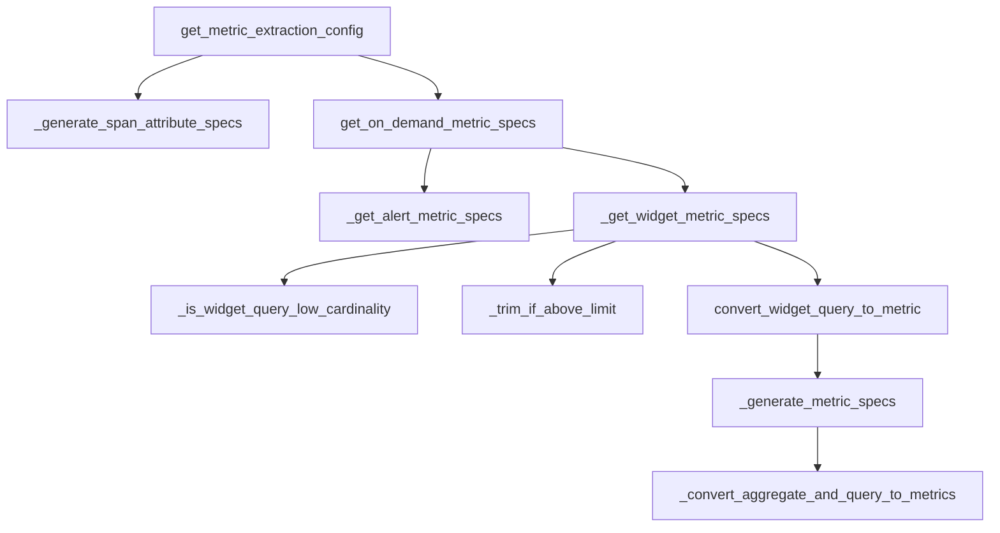

This document will cover the Metric Extraction Flow in the Sentry application. We'll cover:

1. The purpose of the Metric Extraction Flow
2. The process of generating span attribute specifications
3. The process of getting on-demand metric specifications
4. The process of getting alert metric specifications
5. The process of getting widget metric specifications
6. The process of converting widget queries to metrics.

Technical document: <SwmLink doc-title="Metric Extraction Flow">[Metric Extraction Flow](/.swm/metric-extraction-flow.3jsqhti0.sw.md)</SwmLink>

# Purpose of the Metric Extraction Flow

The Metric Extraction Flow is a key process in the Sentry application. It is responsible for extracting metrics from various sources and consolidating them into a unified format. This process is crucial for the application's performance monitoring capabilities. It allows Sentry to provide detailed insights into the performance of different parts of a project, helping developers identify and resolve issues more efficiently.

# Generating Span Attribute Specifications

The process begins with the generation of span attribute specifications. These specifications define the metrics that need to be extracted for a given project. The system checks if the 'organizations:custom-metrics-extraction-rule' feature is enabled for the project's organization. If it is, the system generates rules from the extraction configurations and converts them into metric specifications. If the number of specifications exceeds a certain limit, the system trims the list to maintain efficiency.

# Getting On-Demand Metric Specifications

Next, the system fetches on-demand metric specifications. These are specifications that are not constantly monitored but are fetched as needed. The system checks for enabled features and then retrieves specifications for alerts and widgets. These specifications are then processed in the subsequent steps of the flow.

# Getting Alert Metric Specifications

The system then retrieves alert rules for the project and converts them into metrics. Alert rules define conditions that trigger alerts in the Sentry application. By converting these rules into metrics, the system can monitor these conditions and trigger alerts when necessary. If the number of specifications exceeds a certain limit, the system trims the list to maintain efficiency.

# Getting Widget Metric Specifications

The system also fetches all queries of all on-demand metrics widgets of an organization. It then converts each widget query into a metric specification. If the widget query can use stateful extraction, the system checks if the extraction is enabled. If not, it ignores the widget. If the widget query cannot use stateful extraction, it checks if the widget query has low cardinality. If not, it ignores the widget. Finally, it trims the specifications if they exceed the maximum limit.

# Converting Widget Queries to Metrics

The system then converts each widget query into one or more MetricSpecs. A widget query can result in multiple metric specs if it selects multiple fields. The system generates metric specifications for each aggregate in the widget query. It uses the '\_convert_aggregate_and_query_to_metrics' function to convert each aggregate and query to a metric specification.

&nbsp;

*This is an auto-generated document by Swimm AI 🌊 and has not yet been verified by a human*

<SwmMeta version="3.0.0" repo-id="Z2l0aHViJTNBJTNBc2VudHJ5LWRlbW8lM0ElM0FTd2ltbS1EZW1v" repo-name="sentry-demo" doc-type="product-flows">Powered by [Swimm](/)</SwmMeta>
