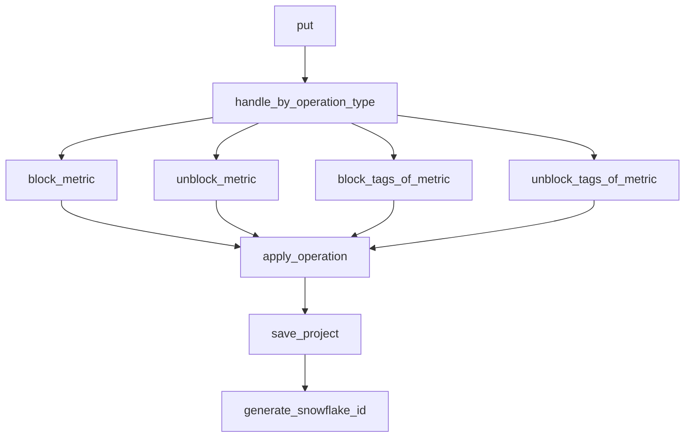

This document will cover the 'put' functionality in the Sentry product, which is part of the Metrics Management feature. We'll cover:

1. The purpose of the 'put' functionality
2. How different metric operations are handled
3. The process of blocking and unblocking metrics
4. The process of blocking and unblocking tags of metrics
5. How metric operations are applied
6. How the project is saved and the generation of a unique ID.

Technical document: <SwmLink doc-title="put">[put](/.swm/understanding-the-put-functionality.g3rfyx14.sw.md)</SwmLink>

# Purpose of the 'put' Functionality

The 'put' functionality serves as the entry point for a flow that handles different types of metric operations. It takes a request and a project as parameters, extracts the 'metric_operation_type' from the request, and checks its validity. Depending on the operation type, it calls the appropriate function and creates an audit log entry. It increments a metrics counter and returns the patched metrics for the project.

# Handling Different Metric Operations

The '\_handle_by_operation_type' function is responsible for handling different types of metric operations. It extracts the 'metricMri' from the request data and checks its validity. Depending on the 'metric_operation_type', it calls the appropriate function ('block_metric', 'unblock_metric', 'block_tags_of_metric', 'unblock_tags_of_metric') and creates an audit log entry.

# Blocking and Unblocking Metrics

The 'block_metric' and 'unblock_metric' functions are called when the 'metric_operation_type' is 'BLOCK_METRIC' or 'UNBLOCK_METRIC' respectively. They increment a metrics counter and call the '\_apply_operation' function with a 'MetricOperation' object and the projects as arguments.

# Blocking and Unblocking Tags of Metrics

The 'block_tags_of_metric' and 'unblock_tags_of_metric' functions are called when the 'metric_operation_type' is 'BLOCK_TAGS' or 'UNBLOCK_TAGS' respectively. They increment a metrics counter and call the '\_apply_operation' function with a 'MetricOperation' object and the projects as arguments.

# Applying Metric Operations

The '\_apply_operation' function applies a metric operation to a sequence of projects. It loads the metrics blocking state from each project, applies the metric operation, and saves the updated state back to the project.

# Saving the Project

The 'save' function persists a project. If the project uses a snowflake ID, it saves the project with a snowflake ID. Otherwise, it saves the project normally.

# Generating Snowflake ID

The 'generate_snowflake_id' function generates a new snowflake ID. It uses a redis key to ensure uniqueness and includes a version ID, region ID, and time difference in the ID.

&nbsp;

*This is an auto-generated document by Swimm AI 🌊 and has not yet been verified by a human*

<SwmMeta version="3.0.0" repo-id="Z2l0aHViJTNBJTNBc2VudHJ5LWRlbW8lM0ElM0FTd2ltbS1EZW1v" repo-name="sentry-demo" doc-type="product-flows">Powered by [Swimm](/)</SwmMeta>
