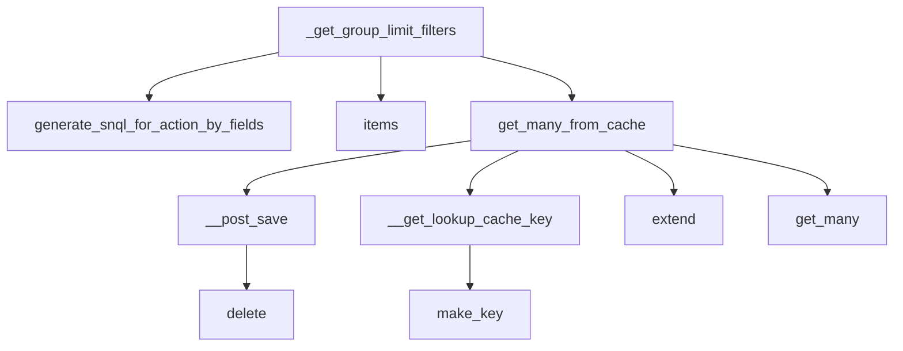

This document will cover the process of generating filters for limiting the results of a metrics query based on the groupby fields in the Sentry application. The main steps involved are:

 1. Understanding the \_get_group_limit_filters function
 2. Role of generate_snql_for_action_by_fields function
 3. Role of items function
 4. Role of get_many_from_cache function
 5. Role of \__post_save function
 6. Role of \__get_lookup_cache_key function
 7. Role of extend function
 8. Role of get_many function
 9. Role of make_key function
10. Role of delete function

Technical document: <SwmLink doc-title="Understanding _get_group_limit_filters Function">[Understanding \_get_group_limit_filters Function](/.swm/understanding-_get_group_limit_filters-function.o7ulfmfn.sw.md)</SwmLink>

# Understanding the \_get_group_limit_filters function

The \_get_group_limit_filters function is a key component in the metrics query process. It is responsible for generating filters that limit the results of a metrics query based on the groupby fields. This function takes in a metrics query, a list of results, and a use case ID as inputs. If the metrics query does not have any groupby fields or if the results list is empty, the function returns None. Otherwise, it creates a mapping of groupby fields to their equivalent SnQL using the generate_snql_for_action_by_fields function. It then constructs a list of conditions based on these mappings and the values of the group keys in the results. Finally, it returns a GroupLimitFilters object containing these conditions.

# Role of generate_snql_for_action_by_fields function

The generate_snql_for_action_by_fields function is used within \_get_group_limit_filters to generate the necessary SnQL for any action by field, which in this case will be group by and order by. It takes in a metric action by field, a use case ID, an organization ID, a sequence of projects, and a boolean indicating whether the action is a column. Depending on the type of the metric action by field, it generates the appropriate SnQL expression.

# Role of items function

The items function is used to return a list of the items in the bitfield. This function is used in the \_get_group_limit_filters function to iterate over the groupby fields in the metrics query.

# Role of get_many_from_cache function

The get_many_from_cache function is a wrapper around QuerySet.filter(pk__in=values) which supports caching of the intermediate value. It queries by primary key or some other unique identifier and returns a sequence of results. If the cache key is not cleared on save, it raises a ValueError.

# Role of \__post_save function

The \__post_save function is called after saving an instance. It pushes changes to an instance into the cache, and removes invalid (changed) lookup values. It also ensures that the database is not serialized into the cache.

# Role of \__get_lookup_cache_key function

The \__get_lookup_cache_key function is used to generate a cache key for a given model and set of arguments.

# Role of extend function

The extend function is used to insert all values from another map into the current one, without mutating the original map.

# Role of get_many function

The get_many function is used to get multiple values from the cache. It supports both namespaced and non-namespaced cache keys.

# Role of make_key function

The make_key function is used to generate a unique key for a given model, prefix, and set of arguments.

# Role of delete function

The delete function is used to mark an instance as deleted by updating its date_deleted field.

&nbsp;

*This is an auto-generated document by Swimm AI 🌊 and has not yet been verified by a human*

<SwmMeta version="3.0.0" repo-id="Z2l0aHViJTNBJTNBc2VudHJ5LWRlbW8lM0ElM0FTd2ltbS1EZW1v" repo-name="sentry-demo" doc-type="product-flows">Powered by [Swimm](/)</SwmMeta>
