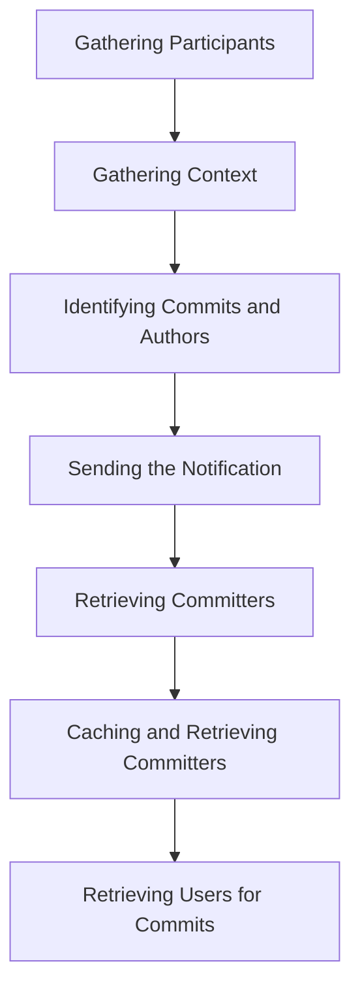

This document will cover the Notification Sending Process in Sentry, which includes:

1. Gathering Participants
2. Gathering Context
3. Identifying Commits and Authors
4. Sending the Notification
5. Retrieving Committers
6. Caching and Retrieving Committers
7. Retrieving Users for Commits

Technical document: <SwmLink doc-title="Notification Sending Process">[Notification Sending Process](/.swm/notification-sending-process.3ueo8fu4.sw.md)</SwmLink>

# Gathering Participants

The process begins by determining who will receive the notification. This is done by mapping providers to participants. The recipients are determined based on the project, target type, target identifier, event, and fallthrough choice. If there are rules, any recipients who are muted according to the rules are filtered out.

# Gathering Context

The next step is to gather all the necessary context for the notification. This includes project details, group details, event details, and rules. The system also checks for enhanced privacy settings and adjusts the context accordingly.

# Identifying Commits and Authors

The system identifies potentially suspect commits and their authors. This is done by retrieving a list of committers for the event file. If there are any group owners for the event, the commit and author details are retrieved. If not, the committers are calculated based on the event frames and the SDK name.

# Sending the Notification

The final step in the main flow is to send the notification. This is done by sending a PUT request, which is typically used to update an existing resource.

# Retrieving Committers

The system retrieves the committers of a file in an event. It first gets the group from the cache and then retrieves the commits associated with the releases of the group. If there are commits, it processes the event frames and retrieves the file changes in the commits.

# Caching and Retrieving Committers

A utility function is used to retrieve a model instance from the cache. If the instance is not found in the cache, it fetches it from the database and stores it in the cache for future use.

# Retrieving Users for Commits

The final function in the focused flow retrieves the users associated with the authors of the commits. It first gets the authors from the cache and then retrieves the users for these authors.

&nbsp;

*This is an auto-generated document by Swimm AI 🌊 and has not yet been verified by a human*

<SwmMeta version="3.0.0" repo-id="Z2l0aHViJTNBJTNBc2VudHJ5LWRlbW8lM0ElM0FTd2ltbS1EZW1v" repo-name="sentry-demo" doc-type="product-flows">Powered by [Swimm](/)</SwmMeta>
