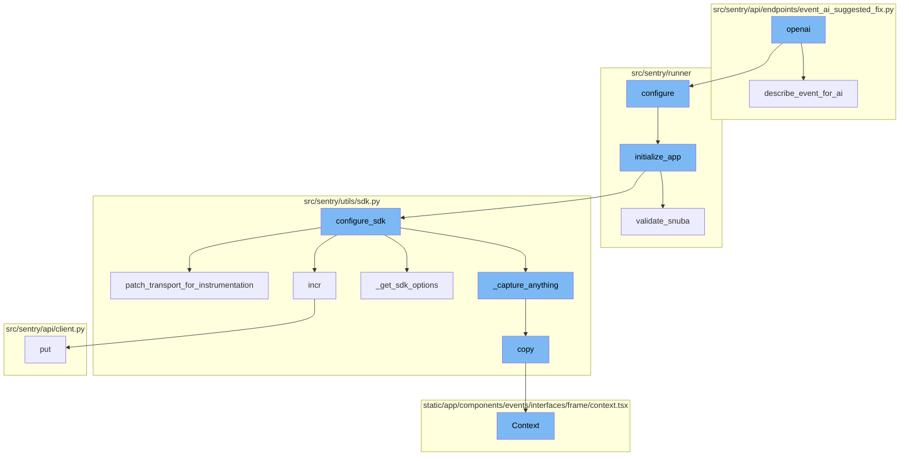

This document will cover the OpenAI Integration in Sentry, which includes:

 1. The main entry point of the OpenAI integration
 2. Preparing the event data for the AI model
 3. Setting up the environment based on different configuration files
 4. Setting up the application based on the provided configuration
 5. Ensuring everything related to Snuba is in sync
 6. Adding a permission to a user
 7. Setting up the SDK for the application
 8. Patching transport functions to add metrics
 9. Incrementing a metric's value
10. Retrieving the SDK options
11. Sending a PUT request
12. Capturing events and metrics
13. Creating a copy of the envelope with safe items
14. Displaying the context of a frame in the Sentry UI

Technical document: <SwmLink doc-title="OpenAI Integration in Sentry">[OpenAI Integration in Sentry](/.swm/openai-integration-in-sentry.ytwcyw4e.sw.md)</SwmLink>

# OpenAI Integration

OpenAI is integrated into the Sentry application to provide AI-assisted error analysis and suggestions for fixes. The main entry point for this functionality is the `openai` function. It takes an event, a model, and a flag to dump the prompt. It first configures the Sentry runner, then loads the event data and depending on the `dump_prompt` flag, it either prints the AI's description of the event or suggests a fix for the event.

# Event Description for AI

The `describe_event_for_ai` function is used to prepare the event data for the AI model. It formats the event data into a structure that the AI model can understand. This includes extracting the message, platform, exceptions, and other relevant information from the event.

# Application Configuration

The `configure` function is the entry point of the OpenAI flow. It takes in the configuration files and sets up the environment accordingly. If the environment is already set up, it simply returns. Otherwise, it adds additional mimetypes for static files, checks if the configuration files exist, and if they do, it sets the environment variables accordingly. Finally, it calls the `initialize_app` function.

# Application Initialization

The `initialize_app` function takes in the configuration and sets up the application accordingly. It sets up various settings, validates the configuration, and initializes various services. It also calls the `validate_snuba` function to ensure that everything related to Snuba is in sync.

# Snuba Validation

The `validate_snuba` function checks if all the required Snuba backends are set up and if the event stream is compatible with Snuba. If not, it raises a configuration error. This function ensures that the Sentry application is correctly configured to use Snuba.

# Permission Addition

The `add` function takes in a user and a permission, and adds the permission to the user. If the permission already exists for the user, it simply returns a message stating so. Otherwise, it adds the permission and returns a success message.

# SDK Configuration

The `configure_sdk` function sets up the SDK for the application. It includes a class `MultiplexingTransport` which has methods for capturing events and envelopes, recording lost events, and checking the health of the transport. The `_capture_anything` method is particularly important as it ensures that events are captured and sent to Sentry.

# Transport Instrumentation

`patch_transport_for_instrumentation` is a function that patches transport functions to add metrics. This helps improve resolution around events sent to the ingest. It modifies the `_send_request` method of the transport to increment a metric before sending the request.

# Metric Increment

`incr` is a function that increments a metric's value. This function is used to track the number of captured and uncaptured events.

# SDK Options Retrieval

`_get_sdk_options` is a function that retrieves the SDK options. It copies the settings from `SENTRY_SDK_CONFIG`, modifies some of them, and returns the options along with the DSNs for Sentry and Relay.

# PUT Request

The `put` function is used to send a PUT request. This function is not directly mentioned in the flow but it might be used in the `request` method that is called within the `incr` function.

# Event Capture

The function `_capture_anything` is the starting point of the OpenAI flow. It is responsible for capturing events and metrics. It checks if the upstream metrics are enabled and if the method name is `capture_envelope`, it filters out all the statsd envelope items, which contain custom metrics sent by the SDK, unless they are allowed via a separate sample rate.

# Metric Increment

The `incr` function is called within `_capture_anything`. It is used to increment a metric's value. This function is used to track the number of captured and uncaptured events.

# Copy Envelope

The `copy` function is called within `_capture_anything` to create a copy of the envelope with safe items. This is done to ensure that the original envelope and its items are distinct references.

# Context Display

The `Context` function is used to display the context of a frame in the Sentry UI. It shows the source code, variables, registers, and assembly related to a frame. It also handles the display of line coverage data if available.

# PUT Request

The `put` function is used to send a PUT request. This function is not directly mentioned in the flow but it might be used in the `request` method that is called within the `incr` function.

&nbsp;

*This is an auto-generated document by Swimm AI 🌊 and has not yet been verified by a human*

<SwmMeta version="3.0.0" repo-id="Z2l0aHViJTNBJTNBc2VudHJ5LWRlbW8lM0ElM0FTd2ltbS1EZW1v" repo-name="sentry-demo" doc-type="product-flows">Powered by [Swimm](/)</SwmMeta>
