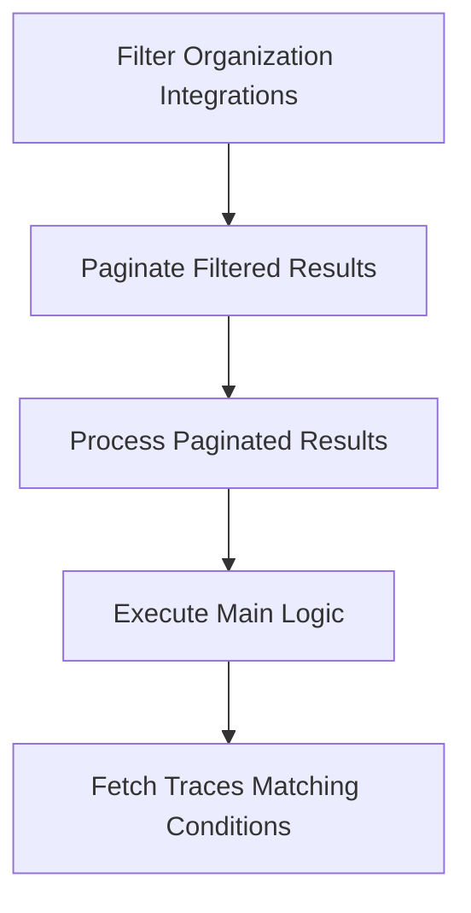

This document will cover the process of 'Organization Integration Filtering and Pagination' in the Sentry application. We'll cover:

1. Filtering Organization Integrations
2. Paginating the filtered results
3. Processing the paginated results
4. Executing the main logic of the flow
5. Fetching traces that match certain conditions.

Technical document: <SwmLink doc-title="Understanding page_organization_integrations_ids">[Understanding page_organization_integrations_ids](/.swm/understanding-page_organization_integrations_ids.tbba4ci8.sw.md)</SwmLink>

# Filtering Organization Integrations

The process begins by filtering the Organization Integration objects based on the provided organization_id and statuses. If a provider_key is provided, the filtering is further refined based on it.

# Paginating the Filtered Results

After filtering, the results are paginated. This involves creating a cursor and a paginator, and then returning a Pagination Result from the paginator's result.

# Processing the Paginated Results

The paginated results are then processed. This involves building the queryset based on the cursor value and then counting the hits. The results are fetched from the queryset and a cursor is built from these results.

# Executing the Main Logic

The main logic of the flow is then executed. This involves getting the traces matching the conditions, refining the parameters, and then performing a series of queries to get the results. The results are then processed and returned.

# Fetching Traces Matching Conditions

The final step involves fetching traces that match certain conditions. Depending on the mri attribute, different methods are used for fetching traces. If mri is not None, the method get_traces_matching_metric_conditions is used, otherwise get_traces_matching_span_conditions is used.

&nbsp;

*This is an auto-generated document by Swimm AI 🌊 and has not yet been verified by a human*

<SwmMeta version="3.0.0" repo-id="Z2l0aHViJTNBJTNBc2VudHJ5LWRlbW8lM0ElM0FTd2ltbS1EZW1v" repo-name="sentry-demo" doc-type="product-flows">Powered by [Swimm](/)</SwmMeta>
