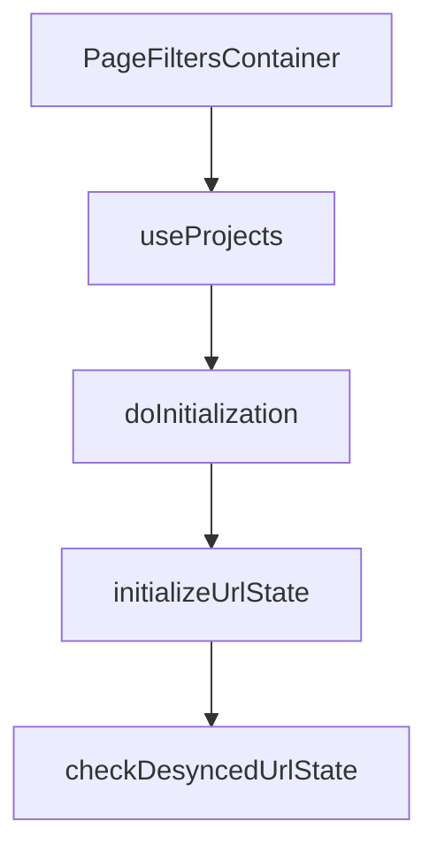

This document will cover the 'Page Filters Initialization' process in the Sentry application. We'll cover:

1. The role of the PageFiltersContainer
2. The use of projects
3. The initialization process
4. The synchronization check.

Technical document: <SwmLink doc-title="Understanding PageFiltersContainer">[Understanding PageFiltersContainer](/.swm/understanding-pagefilterscontainer.6jd5lwar.sw.md)</SwmLink>

# The Role of the PageFiltersContainer

The PageFiltersContainer is a component that manages the initialization of page filters for the content it wraps. It ensures that the children components are not rendered until the filters are ready. It utilizes various properties to manage the state of the page filters, including projects and environments. It also takes care of initializing the GlobalSelectionHeader, which loads the project/environment from local storage when pinned, or populates with defaults.

# The Use of Projects

The useProjects hook provides projects from the ProjectsStore. It also provides a way to select specific project slugs, and search for more projects that may not be in the project store. It fetches projects by slug if necessary and handles search functionality.

# The Initialization Process

The doInitialization function calls initializeUrlState with a set of parameters derived from the component's props and state. This function is used to initialize the URL state based on the current state of the page filters. The initializeUrlState function initializes the URL state based on the provided parameters. It validates the project ID and environment, checks if the URL state has changed in synchronization from the local storage state, and persists that check into the store. It also updates the URL parameters if necessary.

# The Synchronization Check

The checkDesyncedUrlState function checks if the URL state has changed in synchronization from the local storage state, and persists that check into the store. It compares the current query parameters with the stored page filters and updates the desynced filters in the PageFiltersStore.

&nbsp;

*This is an auto-generated document by Swimm AI 🌊 and has not yet been verified by a human*

<SwmMeta version="3.0.0" repo-id="Z2l0aHViJTNBJTNBc2VudHJ5LWRlbW8lM0ElM0FTd2ltbS1EZW1v" repo-name="sentry-demo" doc-type="product-flows">Powered by [Swimm](/)</SwmMeta>
