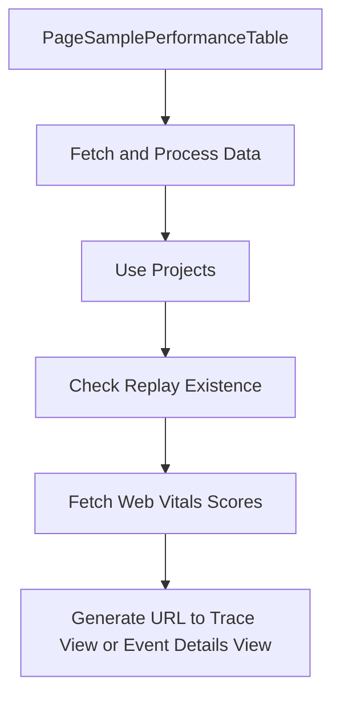

This document will provide a detailed overview of the PageSamplePerformanceTable feature in the Sentry application. We'll cover:

1. The purpose of the PageSamplePerformanceTable feature
2. How the feature fetches and processes necessary data
3. The role of projects in the feature
4. The significance of replay existence
5. The process of fetching web vitals scores for transaction samples
6. The generation of a URL to the trace view or the event details view.

Technical document: <SwmLink doc-title="Understanding PageSamplePerformanceTable">[Understanding PageSamplePerformanceTable](/.swm/understanding-pagesampleperformancetable.91d1l941.sw.md)</SwmLink>

# Purpose of the PageSamplePerformanceTable Feature

The PageSamplePerformanceTable feature is a key component in the Sentry application that renders a performance table for a specific page sample. It takes in a transaction and search parameters, and optionally a limit for the number of results. This feature is crucial for users to understand the performance metrics of specific page samples.

# Role of Projects in the Feature

The useProjects hook provides projects from the ProjectsStore. It also provides a way to select specific project slugs, and search for more projects that may not be in the project store. This is important as it allows users to focus on specific projects and fetch relevant data.

# Significance of Replay Existence

The useProfileExists hook queries results for whether a given replayId exists in the database. This is crucial for ensuring that the data being fetched is valid and exists in the database.

# Fetching Web Vitals Scores for Transaction Samples

The useTransactionSamplesWebVitalsScoresQuery hook fetches the web vitals scores for transaction samples. This data is essential for users to understand the performance metrics of their transactions.

# Generating URL to Trace View or Event Details View

The generateLinkToEventInTraceView function generates a URL to the trace view or the event details view depending on the feature flag. This allows users to easily navigate to detailed views for further analysis.

&nbsp;

*This is an auto-generated document by Swimm AI 🌊 and has not yet been verified by a human*

<SwmMeta version="3.0.0" repo-id="Z2l0aHViJTNBJTNBc2VudHJ5LWRlbW8lM0ElM0FTd2ltbS1EZW1v" repo-name="sentry-demo" doc-type="product-flows">Powered by [Swimm](/)</SwmMeta>
