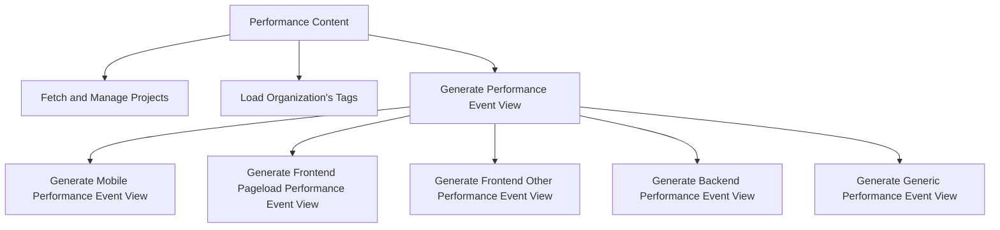

This document will cover the Performance Content feature in the Sentry application. We'll cover:

1. The purpose of the Performance Content feature
2. How the state and data of the performance content is managed
3. The process of fetching and managing the state of projects
4. The process of loading an organization's tags
5. The generation of a performance event view based on the current landing display.

Technical document: <SwmLink doc-title="Understanding PerformanceContent">[Understanding PerformanceContent](/.swm/understanding-performancecontent.ukj1oyqp.sw.md)</SwmLink>

# Purpose of the Performance Content Feature

The Performance Content feature is a key component in the Sentry application. It is responsible for managing the state and data of the performance content. This feature is crucial for the application as it provides the necessary data for performance monitoring.

# Fetching and Managing the State of Projects

The Performance Content feature uses the `useProjects` hook to fetch and manage the state of projects. This hook provides a way to select specific project slugs, and search for more projects that may not be in the project store. This allows the application to handle a large number of projects efficiently.

# Loading an Organization's Tags

The Performance Content feature uses the `loadOrganizationTags` function to load an organization's tags based on a global selection value. This function makes a GET request to the `/organizations/${orgSlug}/tags/` endpoint to fetch the tags. This allows the application to display the relevant tags for each organization.

# Generating a Performance Event View

The Performance Content feature generates a performance event view based on the current landing display. Depending on the display field, it calls the appropriate function to generate a specific performance event view. This allows the application to display the most relevant performance data for each type of display.

&nbsp;

*This is an auto-generated document by Swimm AI 🌊 and has not yet been verified by a human*

<SwmMeta version="3.0.0" repo-id="Z2l0aHViJTNBJTNBc2VudHJ5LWRlbW8lM0ElM0FTd2ltbS1EZW1v" repo-name="sentry-demo" doc-type="product-flows">Powered by [Swimm](/)</SwmMeta>
