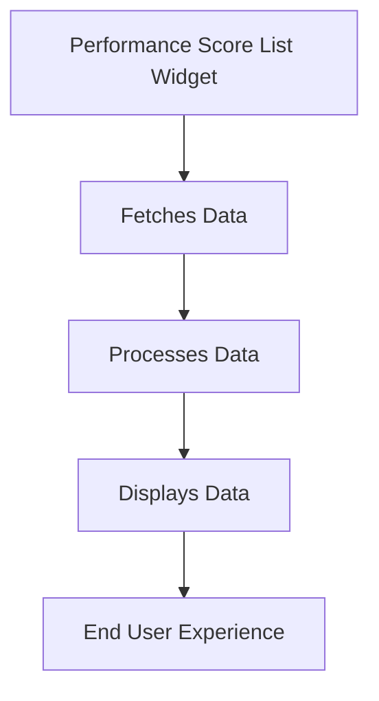

This document will provide a detailed understanding of the Performance Score List Widget feature in the Sentry application. We'll cover:

1. The purpose of the Performance Score List Widget
2. How it fetches and processes data
3. The role of various hooks and queries in data fetching
4. The impact on the end user experience.

Technical document: <SwmLink doc-title="Understanding PerformanceScoreListWidget">[Understanding PerformanceScoreListWidget](/.swm/understanding-performancescorelistwidget.2xp8khkt.sw.md)</SwmLink>

# Purpose of the Performance Score List Widget

The Performance Score List Widget is a feature in the Sentry application that displays performance scores for a project. It provides a comprehensive view of the project's performance metrics, helping users to understand the performance trends and identify areas for improvement.

# Fetching and Processing Data

The Performance Score List Widget fetches and processes data using several hooks and queries. It maintains a state for the selected list index, which controls the data displayed in the accordion component. The data fetching process involves fetching project web vitals scores, transaction web vitals scores, and a timeseries of project web vitals scores. These scores provide a detailed view of the project's performance over time.

# Role of Hooks and Queries

The Performance Score List Widget uses several hooks and queries to fetch and process the data it needs. These include the useTransactionWebVitalsScoresQuery, useProjectWebVitalsScoresQuery, and useProjectWebVitalsScoresTimeseriesQuery hooks. These hooks fetch the necessary data and process it for display in the widget.

# Impact on End User Experience

The Performance Score List Widget enhances the end user experience by providing a comprehensive view of the project's performance metrics. Users can view performance scores for different aspects of the project, helping them to understand the performance trends and identify areas for improvement. This can lead to more informed decision-making and improved project outcomes.

&nbsp;

*This is an auto-generated document by Swimm AI 🌊 and has not yet been verified by a human*

<SwmMeta version="3.0.0" repo-id="Z2l0aHViJTNBJTNBc2VudHJ5LWRlbW8lM0ElM0FTd2ltbS1EZW1v" repo-name="sentry-demo" doc-type="product-flows">Powered by [Swimm](/)</SwmMeta>
