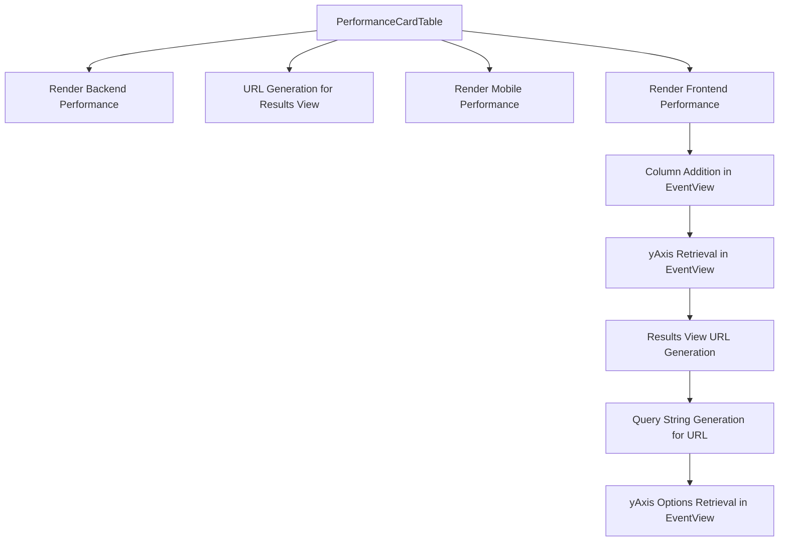

This document will cover the PerformanceCardTable feature, which includes:

 1. Overview of PerformanceCardTable
 2. Rendering Backend Performance
 3. URL Generation for Results View
 4. Rendering Mobile Performance
 5. Query String Generation for Results View URL
 6. Rendering Frontend Performance
 7. Column Addition in EventView
 8. yAxis Retrieval in EventView
 9. Results View URL Generation
10. Query String Generation for URL
11. yAxis Options Retrieval in EventView

Technical document: <SwmLink doc-title="Understanding PerformanceCardTable">[Understanding PerformanceCardTable](/.swm/understanding-performancecardtable.24b40xu2.sw.md)</SwmLink>

# Overview of PerformanceCardTable

The PerformanceCardTable is a feature that presents performance data in a tabular format. It includes several helper functions to render different types of performance data, such as frontend, backend, and mobile performance.

# Rendering Backend Performance

The PerformanceCardTable feature includes a function that specifically handles the rendering of backend performance data. It creates a table with columns for different types of backend performance metrics, such as HTTP and DB spans.

# URL Generation for Results View

The PerformanceCardTable feature includes a method used to generate the URL for the results view. It takes the organization slug and a boolean indicating whether the target is the homepage as parameters, and returns an object containing the pathname and query string for the URL.

# Rendering Mobile Performance

The PerformanceCardTable feature includes a function that handles the rendering of mobile performance data. It creates a table with columns for different types of mobile performance metrics, such as app start times and frame rates.

# Query String Generation for Results View URL

The PerformanceCardTable feature includes a method used to generate the query string object for the results view URL. It returns an object containing various parameters such as the id, name, field, sort, environment, project, query, yAxis, dataset, display, topEvents, and interval.

# Rendering Frontend Performance

The PerformanceCardTable feature includes a function responsible for rendering the performance data. It creates two arrays, webVitals and spans, which hold the performance metrics to be displayed. For each metric, a new view is created with the corresponding columns. This new view is then used to generate a link that leads to the detailed view of the metric.

# Column Addition in EventView

The PerformanceCardTable feature includes a method that takes an array of columns as input and returns a new EventView instance with these columns. It also updates the sort fields and the yAxis of the new EventView instance.

# yAxis Retrieval in EventView

The PerformanceCardTable feature includes a method that returns the yAxis of the EventView instance. If the yAxis is not set, it returns the default option. If the yAxis is set but not included in the yAxis options, it also returns the default option.

# Results View URL Generation

The PerformanceCardTable feature includes a method that generates the URL for the detailed view of the performance metric. It takes the organization slug and a boolean indicating whether the target is the homepage as input, and returns an object containing the pathname and the query string.

# Query String Generation for URL

The PerformanceCardTable feature includes a method that generates the query string for the URL. It includes all the necessary parameters for the detailed view of the performance metric.

# yAxis Options Retrieval in EventView

The PerformanceCardTable feature includes a method that returns the yAxis options for the EventView instance. It filters the aggregate fields to include only those that can be graphed and adds them to the yAxis options.

&nbsp;

*This is an auto-generated document by Swimm AI 🌊 and has not yet been verified by a human*

<SwmMeta version="3.0.0" repo-id="Z2l0aHViJTNBJTNBc2VudHJ5LWRlbW8lM0ElM0FTd2ltbS1EZW1v" repo-name="sentry-demo" doc-type="product-flows">Powered by [Swimm](/)</SwmMeta>
