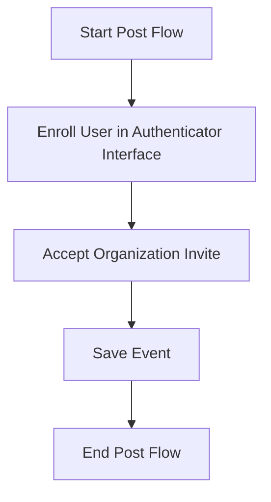

This document will cover the 'Post Flow' feature of the Sentry application. We'll cover:

1. The purpose of the Post Flow
2. The process of enrolling a user in an authenticator interface
3. The process of accepting an organization invite
4. The process of saving an event

Technical document: <SwmLink doc-title="Understanding the Post Flow">[Understanding the Post Flow](/.swm/understanding-the-post-flow.4qwzagf0.sw.md)</SwmLink>

# Purpose of the Post Flow

The 'Post Flow' is a crucial part of the Sentry application. It is responsible for enrolling a user in an authenticator interface, accepting an organization invite, and saving an event. This flow ensures that the user is properly authenticated and that their actions are accurately recorded.

# Enrolling a User in an Authenticator Interface

The first step in the 'Post Flow' is to enroll the user in an authenticator interface. This process involves checking if the user is rate-limited, validating the provided data, and then enrolling the user in the authenticator interface. If the interface allows rotation, the system will update the authenticator's configuration and reset its last used timestamp. If the enrollment is successful, the system will automatically add recovery codes for the user. These recovery codes serve as a backup authentication method for the user.

# Accepting an Organization Invite

The next step in the 'Post Flow' is to handle the acceptance of an organization invite by a user. If the user is not provided, the system defaults to the request user. The system checks if the member already exists and handles it accordingly. If Single Sign-On (SSO) is required, the system checks for a valid AuthIdentity. The system then sets the user for the organization member, ensuring that the user is properly associated with the organization.

# Saving an Event

The final step in the 'Post Flow' is to save an event. This process involves saving an event after it has been normalized and processed. The system saves adjacent models such as releases and environments to the database and writes the event into the eventstream. The system handles different types of events differently, such as transactions and generic events. This ensures that all user actions are accurately recorded and can be retrieved for future reference.

&nbsp;

*This is an auto-generated document by Swimm AI 🌊 and has not yet been verified by a human*

<SwmMeta version="3.0.0" repo-id="Z2l0aHViJTNBJTNBc2VudHJ5LWRlbW8lM0ElM0FTd2ltbS1EZW1v" repo-name="sentry-demo" doc-type="product-flows">Powered by [Swimm](/)</SwmMeta>
