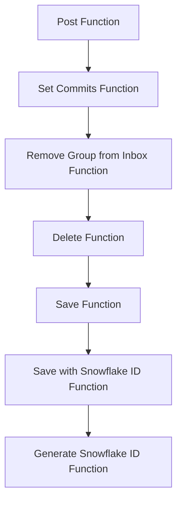

This document will cover the 'Post Flow' feature in the Sentry application. We'll cover:

1. The purpose of the Post Flow
2. The steps involved in the Post Flow
3. The impact of each step on the end user.

Technical document: <SwmLink doc-title="Understanding the Post Flow">[Understanding the Post Flow](/.swm/understanding-the-post-flow.ruqc1gvn.sw.md)</SwmLink>

# Purpose of the Post Flow

The Post Flow is a crucial process in the Sentry application. It is responsible for creating a new release and associating a project with a release. This process improves Sentry's error reporting abilities by correlating first seen events with the release that might have introduced the problem. Releases are also necessary for sourcemaps and other debug features that require manual upload for functioning well.

# Steps involved in the Post Flow

The Post Flow involves several steps. It starts with the 'Post Function', which validates the data in the request and creates a new release with the validated data. If the release already exists, it retrieves the existing release. The function then updates the status of the release if necessary, adds the project to the release, and sets any commits associated with the release. The next step is the 'Set Commits Function', which binds a list of commits to a release, clearing any existing commit log and replacing it with the given commits. Then, the 'Remove Group from Inbox Function' removes a group from the inbox. If the action is 'GroupInboxRemoveAction.MARK_REVIEWED' and a user is provided, it creates an activity marking the group as reviewed. The 'Delete Function' then deletes a project and removes the notification settings for the project. The 'Save Function' saves a project. If the project doesn't have a slug, it generates one. If 'SENTRY_USE_SNOWFLAKE' is true, it saves the project with a snowflake id. The 'Save with Snowflake ID Function' saves a model instance with a snowflake id. If the instance doesn't have an id, it generates a snowflake id and tries to save the instance. Finally, the 'Generate Snowflake ID Function' generates a snowflake id based on the current time, region, and a sequence value from Redis.

# Impact on the end user

The Post Flow has a significant impact on the end user. It ensures that the user's data is accurately represented in the Sentry application. By creating a new release and associating a project with a release, the user can track the performance of their project over time. The process of binding commits to a release allows the user to see the changes that have been made in each release. Removing a group from the inbox helps to keep the user's workspace clean and organized. Deleting a project and removing the notification settings for the project ensures that the user is only notified about relevant updates. Saving a project with a unique slug or snowflake id ensures that the user can easily identify and access their project. Generating a snowflake id based on the current time, region, and a sequence value from Redis ensures that each project has a unique identifier.

&nbsp;

*This is an auto-generated document by Swimm AI 🌊 and has not yet been verified by a human*

<SwmMeta version="3.0.0" repo-id="Z2l0aHViJTNBJTNBc2VudHJ5LWRlbW8lM0ElM0FTd2ltbS1EZW1v" repo-name="sentry-demo" doc-type="product-flows">Powered by [Swimm](/)</SwmMeta>
