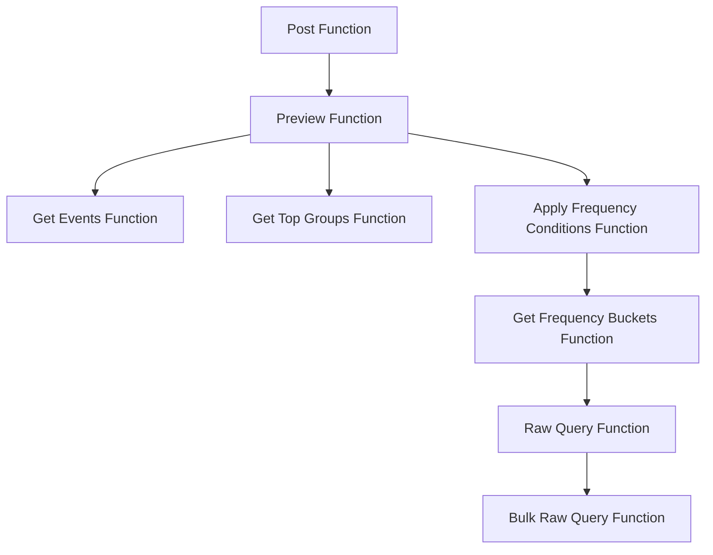

This document will cover the 'Post' function flow in the Sentry application, which is a crucial part of the application's functionality. We'll cover:

1. The purpose of the 'Post' function flow
2. The steps involved in the flow
3. The impact of each step on the end user.

Technical document: <SwmLink doc-title="Post">[Post](/.swm/understanding-the-post-function-flow.y90cb8bc.sw.md)</SwmLink>

# Purpose of the 'Post' Function Flow

The 'Post' function flow serves as the entry point for a series of steps that handle and process incoming requests and data in the Sentry application. This flow is designed to manage various aspects such as previewing, retrieving events, grouping, and applying frequency conditions.

# Steps Involved in the Flow

The flow begins with the 'Post' function, which takes in a request and a project as parameters. The function validates the data in the request and then calls the 'Preview' function with the validated data and the project. The 'Preview' function categorizes the conditions into issue state conditions and frequency conditions. It then retrieves the issue state activity and filters. If there are frequency conditions, it applies them using the 'Apply Frequency Conditions' function. This function applies frequency conditions to issue state activity. The 'Get Frequency Buckets' function is used to put the events of a group into buckets and returns the bucket counts. The 'Raw Query' function sends a query to snuba and the 'Bulk Raw Query' function is used to make queries using the old JSON format for Snuba queries.

# Impact on the End User

The 'Post' function flow is designed to handle and process incoming requests and data, which directly impacts the end user's experience with the Sentry application. The flow ensures that the data is validated, conditions are applied appropriately, and queries are made efficiently. This results in a smooth and efficient user experience.

&nbsp;

*This is an auto-generated document by Swimm AI 🌊 and has not yet been verified by a human*

<SwmMeta version="3.0.0" repo-id="Z2l0aHViJTNBJTNBc2VudHJ5LWRlbW8lM0ElM0FTd2ltbS1EZW1v" repo-name="sentry-demo" doc-type="product-flows">Powered by [Swimm](/)</SwmMeta>
