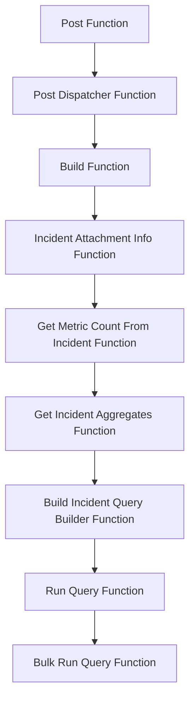

This document will cover the flow of the 'Post Function' in the Sentry application. We'll cover:

1. The purpose of the 'Post Function' flow
2. The steps involved in the flow
3. The impact of each step on the end user.

Technical document: <SwmLink doc-title="Understanding the Post Function Flow">[Understanding the Post Function Flow](/.swm/understanding-the-post-function-flow.665fcmrz.sw.md)</SwmLink>

# Post Function

The 'Post Function' is the entry point for handling requests in the application. It validates the incoming request and if successful, it delegates the request handling to the 'Post Dispatcher' function. This ensures that only valid requests are processed further, enhancing the security and efficiency of the application.

# Post Dispatcher Function

The 'Post Dispatcher' function is responsible for routing the request to the appropriate handler based on the command received in the request. This ensures that each request is handled by the correct function, improving the application's responsiveness and accuracy.

# Build Function

The 'Build' function constructs the message to be sent as a response. It uses the 'Incident Attachment Info' function to gather the necessary data for the message. This ensures that the response message is informative and relevant to the user's request.

# Incident Attachment Info Function

The 'Incident Attachment Info' function retrieves detailed information about an incident. If the metric value is not provided, it calls the 'Get Metric Count From Incident' function to fetch it. This ensures that the response message includes all the necessary details about the incident.

# Get Metric Count From Incident Function

The 'Get Metric Count From Incident' function retrieves the current or last count of an incident aggregate. It uses the 'Get Incident Aggregates' function to get the count. This ensures that the response message includes the most recent and relevant data about the incident.

# Get Incident Aggregates Function

The 'Get Incident Aggregates' function calculates aggregate stats across the life of an incident. It uses the 'Build Incident Query Builder' function to construct the query. This ensures that the response message includes comprehensive statistics about the incident.

# Build Incident Query Builder Function

The 'Build Incident Query Builder' function constructs the query to fetch incident aggregates. It sets up the conditions and limits for the query. This ensures that the query retrieves the most relevant data for the response message.

# Run Query Function

The 'Run Query' function is the entry point for executing a metrics query in Snuba. It uses the 'Bulk Run Query' function to execute the query. This ensures that the query is executed efficiently and accurately.

# Bulk Run Query Function

The 'Bulk Run Query' function executes a list of metrics queries in Snuba. It sets up the queries, executes them, and processes the results. This ensures that all the necessary data is retrieved for the response message.

&nbsp;

*This is an auto-generated document by Swimm AI 🌊 and has not yet been verified by a human*

<SwmMeta version="3.0.0" repo-id="Z2l0aHViJTNBJTNBc2VudHJ5LWRlbW8lM0ElM0FTd2ltbS1EZW1v" repo-name="sentry-demo" doc-type="product-flows">Powered by [Swimm](/)</SwmMeta>
