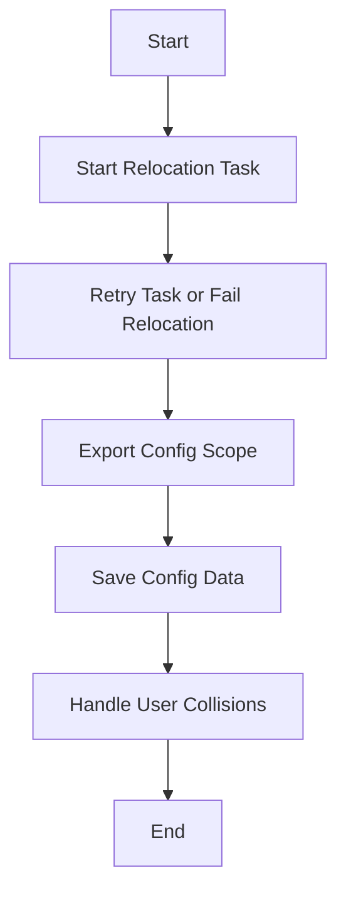

This document will cover the process of 'Preprocessing Baseline Config' in Sentry. We'll cover:

1. The purpose of Preprocessing Baseline Config
2. The process of starting the relocation task
3. The retry mechanism for task failure
4. The process of exporting config scope
5. The process of saving the config data
6. The process of handling user collisions.

Technical document: <SwmLink doc-title="Understanding Preprocessing Baseline Config">[Understanding Preprocessing Baseline Config](/.swm/understanding-preprocessing-baseline-config.x1cssdcs.sw.md)</SwmLink>

# Purpose of Preprocessing Baseline Config

The Preprocessing Baseline Config is a process that pulls down the global config data needed to check for collisions and global data integrity. This process is designed to be idempotent, meaning it can be run multiple times without changing the result beyond the initial application. It should be retried with an exponential backoff in case of failure.

# Starting the Relocation Task

The process begins by starting a relocation task. This task is initiated with a unique identifier (UUID), the task type as 'Preprocessing Baseline Config', and a specified maximum number of fast task attempts. This task is responsible for moving data from one location to another.

# Retry Mechanism for Task Failure

The process includes a retry mechanism in case of task failure. If the task fails, it will be retried until the number of attempts left reaches zero. At this point, the relocation will be marked as failed. This mechanism ensures that temporary issues do not cause the entire process to fail.

# Exporting Config Scope

The process then exports the in-config scope into a data object. This is done using a specific function, which takes the data object, an encryptor, and a printer as arguments. This step is crucial for preserving the integrity of the global config data.

# Saving the Config Data

The exported config data is then saved to the relocation storage. The path for the storage is constructed using the UUID and the kind of the file. This step ensures that the config data is safely stored and can be accessed when needed.

# Handling User Collisions

Finally, the process applies a task that handles any user collisions that might occur during the relocation process. User collisions can occur when two or more users attempt to modify the same data at the same time. This task ensures that such collisions are handled appropriately and do not cause data corruption.

&nbsp;

*This is an auto-generated document by Swimm AI 🌊 and has not yet been verified by a human*

<SwmMeta version="3.0.0" repo-id="Z2l0aHViJTNBJTNBc2VudHJ5LWRlbW8lM0ElM0FTd2ltbS1EZW1v" repo-name="sentry-demo" doc-type="product-flows">Powered by [Swimm](/)</SwmMeta>
