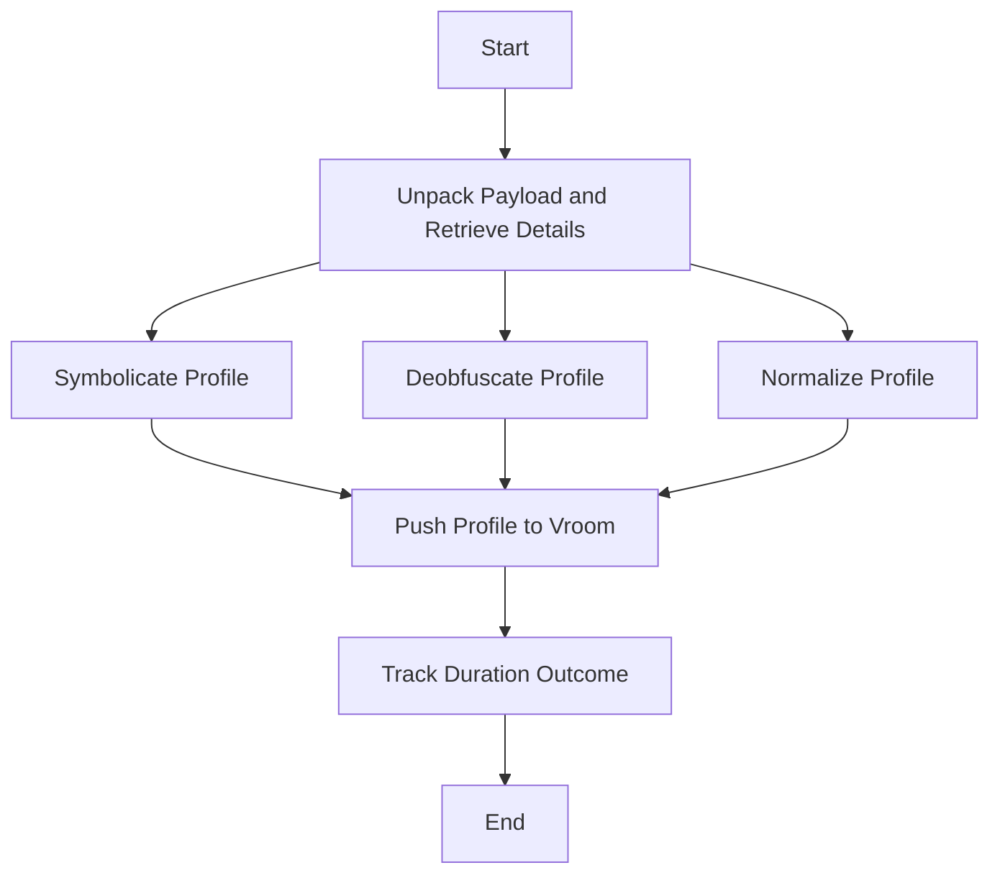

This document will cover the process of profile processing in Sentry, which includes:

1. Unpacking the payload and retrieving organization and project details.
2. Symbolicating, deobfuscating, and normalizing the profile.
3. Pushing the profile to vroom and tracking the duration outcome.

Technical document: <SwmLink doc-title="Understanding the process_profile_task Function">[Understanding the process_profile_task Function](/.swm/understanding-the-process_profile_task-function.xplfqnyq.sw.md)</SwmLink>

# Unpacking the Payload and Retrieving Details

The process starts by unpacking the payload and retrieving the organization and project details. This is the initial step where we gather all the necessary information about the profile and the project it belongs to.

# Symbolicating the Profile

Symbolication is the process of replacing memory addresses with human-readable function names and line numbers. This step prepares the frames from the profile, runs the symbolication process, and processes the results. If symbolication fails, the outcome is tracked as invalid.

# Deobfuscating the Profile

Deobfuscation is the process of reversing obfuscation, making the code readable and understandable. The profile is checked if it needs to be deobfuscated. If it does, the deobfuscation process is initiated and the 'deobfuscated' flag in the profile is set to 'True'. If an exception occurs during this process, it is captured and the outcome is set to 'INVALID' with the reason set to 'profiling_failed_deobfuscation'.

# Normalizing the Profile

Normalization is the process of adjusting values measured on different scales to a common scale. The profile is normalized in this step. If normalization fails, the outcome is tracked as invalid.

# Pushing the Profile to Vroom

The profile is then attempted to be inserted into vroom. If the insertion fails, the outcome is tracked as invalid.

# Tracking Duration Outcome

The profile duration is calculated and the outcome is tracked as accepted. This step helps in understanding the time taken for the profile processing.

&nbsp;

*This is an auto-generated document by Swimm AI 🌊 and has not yet been verified by a human*

<SwmMeta version="3.0.0" repo-id="Z2l0aHViJTNBJTNBc2VudHJ5LWRlbW8lM0ElM0FTd2ltbS1EZW1v" repo-name="sentry-demo" doc-type="product-flows">Powered by [Swimm](/)</SwmMeta>
