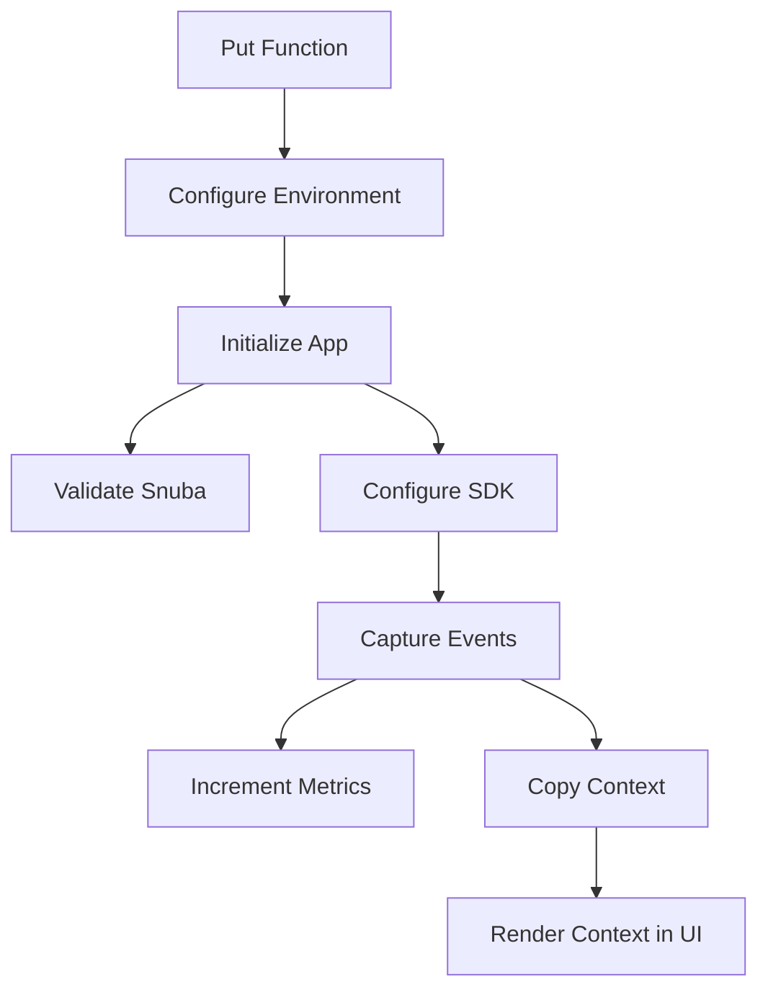

This document will cover the 'put' function flow in the Sentry application. We'll cover:

1. The purpose of the 'put' function
2. The steps involved in the 'put' function flow
3. The impact of the 'put' function on the end user.

Technical document: <SwmLink doc-title="put">[put](/.swm/understanding-the-put-function-and-its-flow.lmx8ty3x.sw.md)</SwmLink>

# The 'put' Function

The 'put' function is the starting point of the flow. It handles HTTP PUT requests, which are typically used to update a resource on the server. In the context of Sentry, the 'put' function is used to update feature flags in the application. Feature flags are used to enable or disable certain features in the application. The 'put' function checks if the Sentry instance is self-hosted, retrieves the feature flags from the request data, updates the feature flags in a configuration file, and then initiates the next step in the flow.

# Configuring the Environment

The 'configure' function is called by the 'put' function. It sets up the environment for the application based on two different configuration files. This involves checking if the files exist and setting up the necessary environment variables. The environment setup is crucial for the application to function correctly.

# Initializing the Application

The 'initialize_app' function is called by the 'configure' function. It sets up the application and validates the settings. This includes checking if the Snuba service is correctly configured. Snuba is a service used by Sentry for storing and querying event data. If Snuba is not correctly configured, an error is raised. The 'initialize_app' function also calls the 'configure_sdk' function to configure the Sentry SDK.

# Configuring the Sentry SDK

The 'configure_sdk' function sets up the Sentry SDK. The SDK (Software Development Kit) is a set of tools that allows developers to create applications for a specific platform. In this case, the Sentry SDK is used to capture events, errors, and transactions and send them to Sentry. The 'configure_sdk' function defines methods for capturing envelopes and events, recording lost events, checking health, and flushing.

# Capturing Events

The '\_capture_anything' function is part of the Sentry SDK. It's responsible for capturing events, errors, and transactions and sending them to Sentry. This function also handles metrics and sampling. Metrics are used to measure the performance of the application, while sampling is used to collect a subset of data which can be analyzed to gain insights about the entire data set.

# Incrementing Metrics

The 'incr' function is used to increment a metric. This function is used within the '\_capture_anything' function to increment internal metrics related to captured and uncaptured events. Metrics provide a way to measure the performance of the application and are crucial for monitoring and troubleshooting.

# Copying the Context

The 'copy' function is used to create a copy of the current context. This is useful when you want to modify the context for a specific operation without affecting the original context. In the context of Sentry, this function is used to create a copy of the current context before rendering it in the UI.

# Rendering the Context in the UI

The 'Context' function is a React component that renders the context of a frame in the Sentry UI. It displays source code, variables, registers, and assembly related to the frame. This is crucial for the end user as it provides a visual representation of the context of a frame, making it easier to understand and debug.

&nbsp;

*This is an auto-generated document by Swimm AI 🌊 and has not yet been verified by a human*

<SwmMeta version="3.0.0" repo-id="Z2l0aHViJTNBJTNBc2VudHJ5LWRlbW8lM0ElM0FTd2ltbS1EZW1v" repo-name="sentry-demo" doc-type="product-flows">Powered by [Swimm](/)</SwmMeta>
